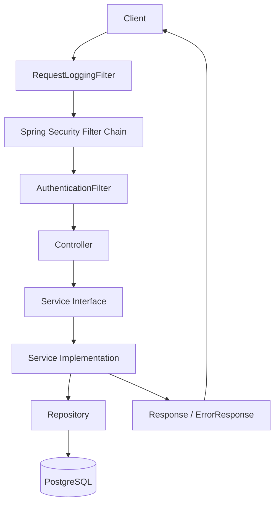
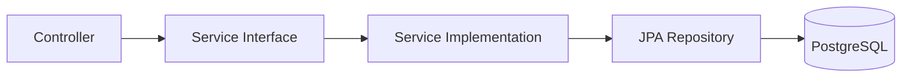
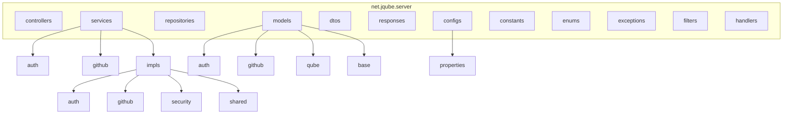
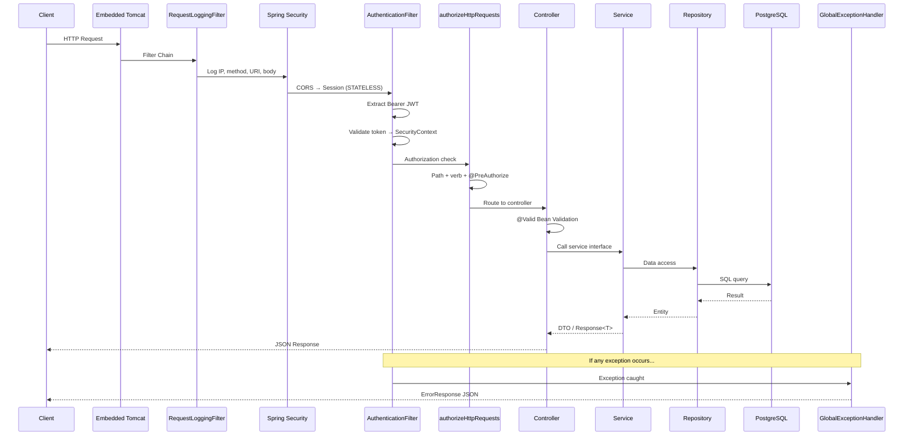
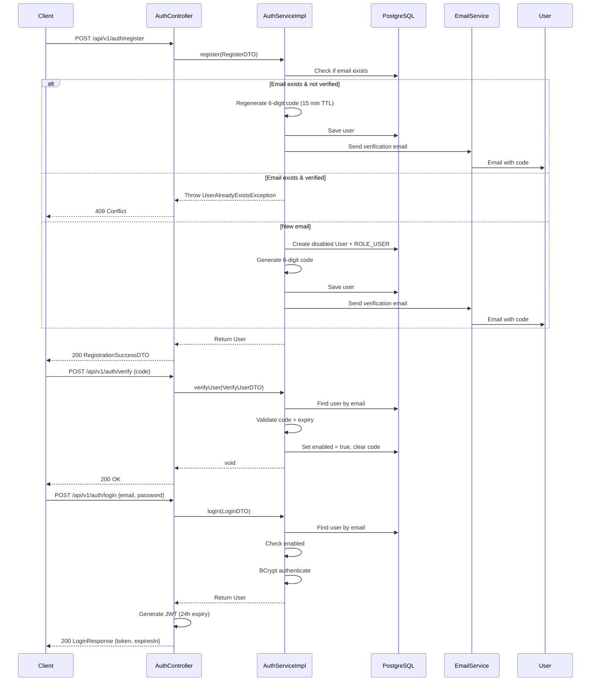
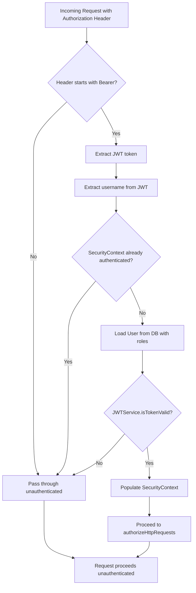
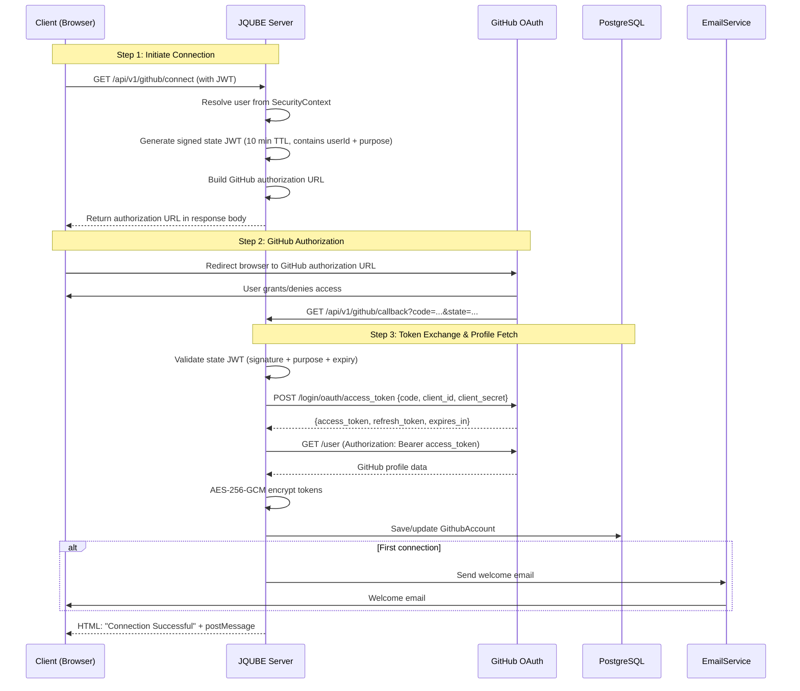
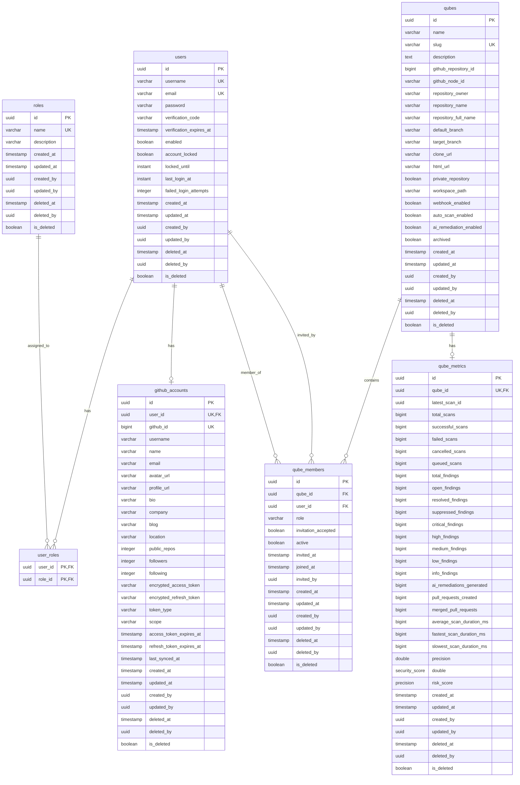

# JQUBE Server


**JQUBE Server** is a Spring Boot 3.2 / Java 17 REST API backend providing JWT-based authentication, email-verified user registration, role-based access control (RBAC), GitHub account linking via a hand-rolled OAuth2 authorization-code flow, and a Qube (security-scan workspace) domain model. The project is stateless by design, using PostgreSQL for persistence and Flyway for schema migrations.

---

## Table of Contents

- [Project Structure](#project-structure)
- [Technology Stack](#technology-stack)
- [Architecture Overview](#architecture-overview)
- [Request Lifecycle](#request-lifecycle)
- [Authentication & Authorization](#authentication--authorization)
- [Database Schema](#database-schema)
- [API Surface](#api-surface)
- [Getting Started](#getting-started)
- [Configuration](#configuration)
- [Testing](#testing)
- [Deployment](#deployment)
- [Contributing](#contributing)

---

## Project Structure

```
C:\Project\JQUBE-server
├── app/
│   └── server/                        # Main Spring Boot application module
│       ├── src/
│       │   ├── main/
│       │   │   ├── java/net/jqube/server/
│       │   │   │   ├── JQubeServer.java          # Application entry point
│       │   │   │   ├── configs/                  # Spring configuration classes
│       │   │   │   ├── controllers/              # REST controllers
│       │   │   │   ├── dtos/                     # Request/response DTOs
│       │   │   │   ├── enums/                    # Role and authority enums
│       │   │   │   ├── exceptions/               # Custom exceptions
│       │   │   │   ├── filters/                  # Servlet filters
│       │   │   │   ├── handlers/                 # Global exception handler
│       │   │   │   ├── models/                   # JPA entities
│       │   │   │   ├── repositories/             # Spring Data JPA repositories
│       │   │   │   ├── responses/                # API envelope wrappers
│       │   │   │   └── services/                 # Business logic (interfaces + impls)
│       │   │   └── resources/
│       │   │       ├── application.yml           # Main configuration
│       │   │       ├── db/migration/             # Flyway SQL migrations (V1–V8)
│       │   │       ├── templates/                # Thymeleaf email templates
│       │   │       └── static/                   # Static assets
│       │   └── test/                             # Unit and integration tests
│       │       └── integration_tests/            # Security integration tests
│       ├── pom.xml                              # Maven build definition
│       ├── Dockerfile                           # Container image definition
│       ├── .env.example                         # Environment variable template
│       └── README.md                            # Detailed architecture docs
├── README.md                                    # This file
├── API.md                                       # Endpoint reference
├── ARCHITECTURE.md                              # C4 model and deep-dive architecture
└── DEVELOPMENT.md                               # Setup, build, and contribution guide
```

---

## Technology Stack

| Layer | Technology |
|---|---|
| **Language** | Java 17 |
| **Framework** | Spring Boot 3.2.0 (Web, Security, Data JPA, Validation, Mail, Thymeleaf) |
| **Database** | PostgreSQL 15+ |
| **Migrations** | Flyway Core + Flyway PostgreSQL |
| **Security** | Spring Security + JJWT 0.11.5 (HS256 JWT) |
| **Encryption** | AES-256-GCM (custom service) |
| **API Docs** | springdoc-openapi 2.2.0 (Swagger UI) |
| **Mail** | Spring Mail (Gmail SMTP:465 SSL) + Thymeleaf templates |
| **Env Mgmt** | spring-dotenv 4.0.0 (`.env` file loading) |
| **HTTP Client** | Spring `RestClient` (GitHub API integration) |
| **Build** | Maven 3.9+ |
| **Boilerplate** | Lombok 1.18.30 |
| **Testing** | JUnit 5, Spring Security Test, Testcontainers (PostgreSQL), AssertJ, Mockito |

---

## Architecture Overview

JQUBE Server follows a **Layered (N-Tier) Architecture** with strict one-way dependencies. Every business capability is exposed as a service interface, implemented separately, so controllers never depend on a concrete class.

### High-Level Dependency Flow



**Dependency direction (strictly one-way):**



### Package Structure



---

## Request Lifecycle

Every HTTP request flows through the following pipeline:



---

## Authentication & Authorization

### Registration & Email Verification Flow



### JWT Validation on Subsequent Requests



### GitHub OAuth2 Flow (Hand-Rolled)



### Authorization Model

```mermaid
flowchart TD
    A[Incoming Request] --> B{Public endpoint?}
    B -->|Yes| C[Allow]
    B -->|No| D{Has Bearer JWT?}
    D -->|No| E[401 Unauthorized]
    D -->|Yes| F{Token valid?}
    F -->|No| E
    F -->|Yes| G{HTTP Method?}

    G -->|GET| H{Has ADMIN, USER, or VIEWER?}
    G -->|POST/PUT| I{Has ADMIN or USER?}
    G -->|PATCH/DELETE| J{Has ADMIN?}

    H -->|Yes| K{@PreAuthorize check?}
    H -->|No| E
    I -->|Yes| K
    I -->|No| E
    J -->|Yes| K
    J -->|No| E

    K -->|Pass| C
    K -->|Fail| E

    C --> L[Controller method executes]
```

---

## Database Schema



---

## API Surface

All endpoints return a consistent `Response<T>` envelope:

```json
{
  "success": true,
  "status": 200,
  "message": "...",
  "data": { ... }
}
```

### Auth Endpoints

| Method | Path | Auth | Description |
|---|---|---|---|
| `POST` | `/api/v1/auth/register` | Public | Register new user |
| `POST` | `/api/v1/auth/login` | Public | Login with credentials |
| `POST` | `/api/v1/auth/verify` | Public | Verify email with 6-digit code |
| `POST` | `/api/v1/auth/resend-code` | Public | Resend verification code |

### User Endpoints

| Method | Path | Auth | Description |
|---|---|---|---|
| `GET` | `/api/v1/user/me` | ADMIN, USER, VIEWER | Get current user profile |

### Admin Endpoints

| Method | Path | Auth | Description |
|---|---|---|---|
| `GET` | `/api/v1/admin/users` | ADMIN | List all users |
| `GET` | `/api/v1/admin/users/{id}` | ADMIN | Get user by ID |
| `DELETE` | `/api/v1/admin/users/{id}` | ADMIN | Delete user |
| `PUT` | `/api/v1/admin/users/{id}/roles` | ADMIN | Replace user roles |
| `POST` | `/api/v1/admin/roles` | ADMIN | Create new role |
| `GET` | `/api/v1/admin/roles` | ADMIN | List all roles |

### GitHub Endpoints

| Method | Path | Auth | Description |
|---|---|---|---|
| `GET` | `/api/v1/github/connect` | USER | Get GitHub authorization URL |
| `GET` | `/api/v1/github/callback` | Public | GitHub OAuth callback |
| `GET` | `/api/v1/github/profile` | USER | Get linked GitHub profile |
| `DELETE` | `/api/v1/github/disconnect` | USER | Disconnect GitHub account |

### Health & Docs

| Method | Path | Auth | Description |
|---|---|---|---|
| `GET` | `/health` | Public | Server health check |
| `GET` | `/v3/api-docs/**` | Public | OpenAPI JSON |
| `GET` | `/swagger-ui.html` | Public | Swagger UI |

---

## Getting Started

### Prerequisites

- Java 17+
- Maven 3.9+
- PostgreSQL 15+
- A Gmail account (for email verification)

### Local Setup

```bash
# 1. Clone the repository
git clone https://github.com/your-org/JQUBE-server.git
cd JQUBE-server/app/server

# 2. Copy environment template
cp .env.example .env

# 3. Edit .env with your values
#    Required: SPRING_DATASOURCE_URL, SPRING_DATASOURCE_USERNAME, SPRING_DATASOURCE_PASSWORD,
#              SUPPORT_EMAIL, APP_PASSWORD, JWT_SECRET_KEY, GITHUB_OAUTH_*

# 4. Build and run
./mvnw spring-boot:run
```

The server starts on port `8080` by default. Swagger UI is available at `http://localhost:8080/swagger-ui.html`.

### Build

```bash
cd app/server
./mvnw clean package
java -jar target/server-0.0.1-SNAPSHOT.jar
```

---

## Configuration

Configuration is loaded from `application.yml` and `.env` (via `spring-dotenv`).

```mermaid
flowchart LR
    A[application.yml] --> B[Spring Environment]
    C[.env file] --> B
    D[System Environment Variables] --> B
    B --> E[@Value injection]
    B --> F[@ConfigurationProperties]
    E --> G[Beans / Services]
    F --> G
```

Key configuration groups:

| Group | Prefix | Purpose |
|---|---|---|
| Server | `server.*` | Port, servlet config |
| DataSource | `spring.datasource.*` | PostgreSQL connection |
| JPA | `spring.jpa.*` | Hibernate DDL mode |
| Flyway | `spring.flyway.*` | Migration locations |
| Mail | `spring.mail.*` | Gmail SMTP settings |
| GitHub OAuth | `github.oauth.*` | Client ID, secret, redirect URI |
| JWT | `security.jwt.*` | Secret key, expiry time |
| Encryption | `security.encryption.*` | AES-256 key |
| Client | `client.url` | Frontend URL for redirects |
| OpenAPI | `springdoc.*` | Swagger UI settings |

---

## Testing

```bash
cd app/server

# Run all tests (unit + integration with Testcontainers)
./mvnw test

# Run only unit tests
./mvnw test -Dtest="*Test"

# Run integration tests
./mvnw test -Dtest="*IntegrationTest"
```

The project uses **Testcontainers** for integration tests, spinning up an ephemeral PostgreSQL container automatically. No local database is required for tests.

---

## Deployment

### Docker (Planned)

The `app/server/Dockerfile` is a placeholder. To containerize:

```dockerfile
FROM eclipse-temurin:17-jdk-alpine
COPY target/server-0.0.1-SNAPSHOT.jar app.jar
EXPOSE 8080
ENTRYPOINT ["java", "-jar", "/app.jar"]
```

### Environment Variables (Production)

| Variable | Required | Description |
|---|---|---|
| `SERVER_PORT` | No | HTTP port (default: 8080) |
| `SPRING_DATASOURCE_URL` | Yes | JDBC URL |
| `SPRING_DATASOURCE_USERNAME` | Yes | DB username |
| `SPRING_DATASOURCE_PASSWORD` | Yes | DB password |
| `SUPPORT_EMAIL` | Yes | Gmail sender address |
| `APP_PASSWORD` | Yes | Gmail app password |
| `JWT_SECRET_KEY` | Yes | Base64-encoded HS256 secret |
| `GITHUB_OAUTH_CLIENT_ID` | Yes | GitHub OAuth app ID |
| `GITHUB_OAUTH_CLIENT_SECRET` | Yes | GitHub OAuth app secret |
| `GITHUB_REDIRECT_URI` | Yes | OAuth callback URL |
| `CLIENT_URL` | Yes | Frontend application URL |
| `AES_ENCRYPTION_KEY` | Yes | AES-256 encryption key |

---

## Contributing

See [DEVELOPMENT.md](DEVELOPMENT.md) for setup instructions, code conventions, and contribution guidelines.

---

## License

MIT
