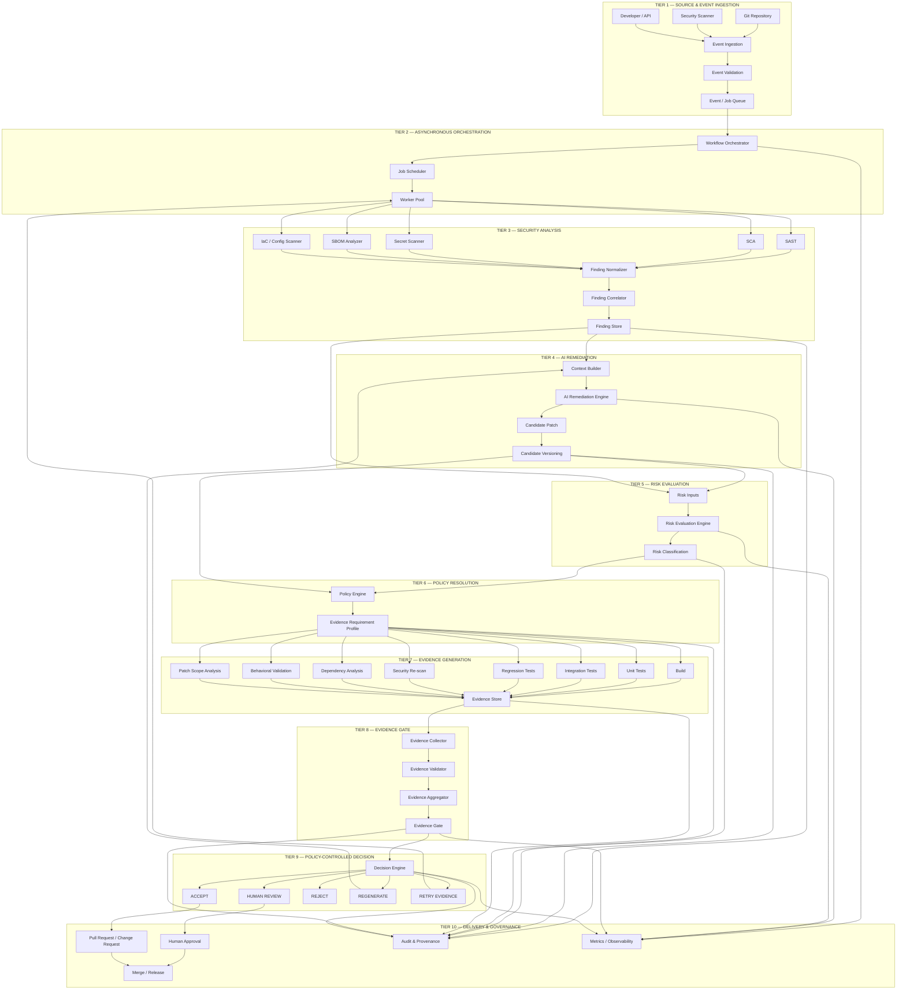
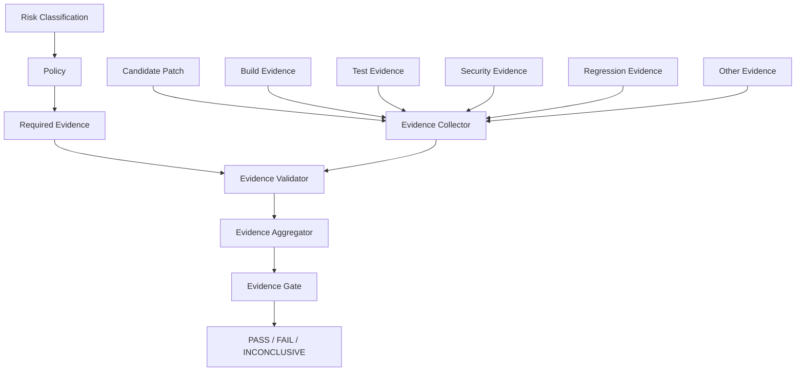
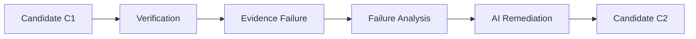
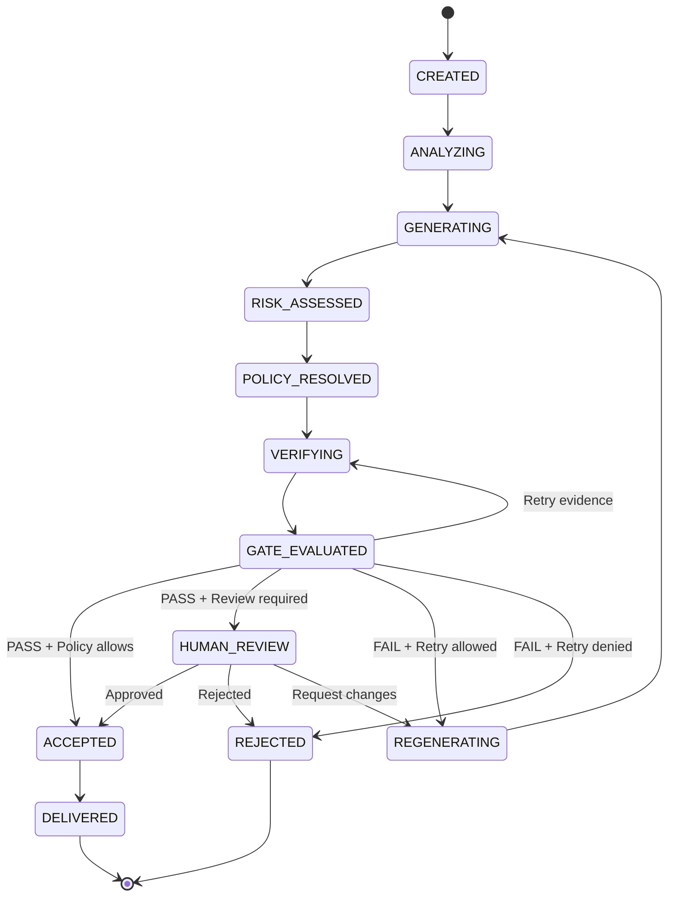
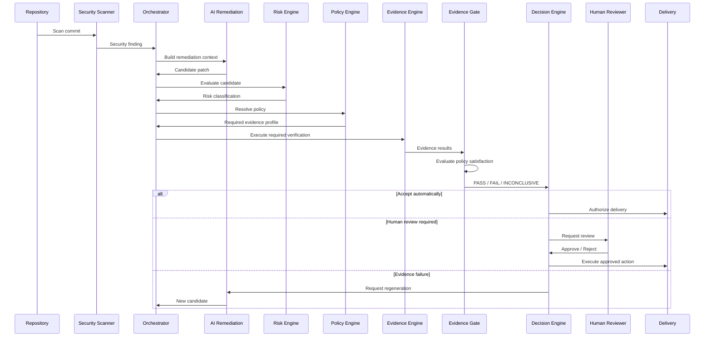

# JQube Architecture

> **JQube is a policy-controlled, asynchronous DevSecOps framework that treats AI-generated security remediation as an untrusted candidate and requires risk-adaptive evidence before the candidate can cross the delivery trust boundary.**

---

# 1. Architectural Overview

JQube addresses a fundamental problem in AI-assisted DevSecOps:

```text
An AI system can generate a plausible security fix,
but plausibility does not establish correctness or safety.
```

A generated patch may:

* fail to remove the original vulnerability,
* introduce a new vulnerability,
* break existing functionality,
* cause regressions,
* modify more code than necessary,
* introduce dependency risk,
* behave differently in production,
* or satisfy one test while violating another security property.

Therefore, JQube does **not** treat the AI-generated patch as a trusted remediation.

Instead, the patch enters the system as a:

```text
Candidate Remediation
```

and passes through:

```text
Risk Evaluation
       ↓
Policy Resolution
       ↓
Evidence Generation
       ↓
Evidence Gate
       ↓
Policy-Controlled Decision
       ↓
Delivery / Review / Rejection / Regeneration
```

The central architectural relationship is:

```text
                 AI
                 |
                 v
        Candidate Remediation
                 |
                 v
        +-------------------+
        |  Risk Evaluation  |
        +---------+---------+
                  |
                  v
        +-------------------+
        |  Policy Engine    |
        +---------+---------+
                  |
                  v
        Evidence Requirements
                  |
                  v
        +-------------------+
        | Evidence Engine   |
        +---------+---------+
                  |
                  v
        +-------------------+
        |  Evidence Gate    |
        +---------+---------+
                  |
                  v
        +-------------------+
        | Decision Engine   |
        +---------+---------+
                  |
       +----------+----------+
       |          |          |
       v          v          v
    ACCEPT     REVIEW     REJECT/
                           RETRY
```

---

# 2. Architectural Goals

JQube has the following goals.

## 2.1 Untrusted AI Output

AI-generated code must never automatically become an accepted remediation.

```text
AI Output
    ≠
Trusted Remediation
```

Instead:

```text
AI Output
    =
Candidate
```

---

## 2.2 Risk-Adaptive Verification

Not every remediation requires the same amount of verification.

A low-risk candidate may require:

```text
Build
+
Focused Tests
```

while a high-risk candidate may require:

```text
Build
+
Unit Tests
+
Integration Tests
+
Regression Tests
+
Security Re-scan
+
Dependency Analysis
+
Behavioral Validation
+
Human Review
```

---

## 2.3 Policy-Controlled Authorization

The AI does not decide what evidence is sufficient.

The policy engine determines:

```text
Risk
+
Context
+
Repository Policy
+
Change Characteristics
        ↓
Required Evidence
```

---

## 2.4 Evidence-Based Trust

The candidate crosses the trust boundary only when the required evidence satisfies policy.

```text
Candidate
    |
    v
Evidence
    |
    v
Evidence Gate
    |
    +---- FAIL
    |
    +---- INCONCLUSIVE
    |
    +---- PASS
```

---

## 2.5 Full Provenance

Every decision must be traceable to:

```text
Finding
→ AI Candidate
→ Risk
→ Policy
→ Evidence
→ Gate Result
→ Decision
→ Human Action
→ Delivery
```

---

# 3. Complete System Architecture



---

# 4. Architectural Tiers

| Tier | Name                  | Primary Responsibility                      |
| ---- | --------------------- | ------------------------------------------- |
| 1    | Source & Ingestion    | Receive and validate events                 |
| 2    | Orchestration         | Manage asynchronous workflow                |
| 3    | Security Analysis     | Detect and normalize findings               |
| 4    | AI Remediation        | Generate candidate patches                  |
| 5    | Risk Evaluation       | Assess candidate risk                       |
| 6    | Policy Resolution     | Determine required evidence                 |
| 7    | Evidence Generation   | Produce verification evidence               |
| 8    | Evidence Gate         | Determine whether evidence satisfies policy |
| 9    | Decision              | Select authorized next action               |
| 10   | Delivery & Governance | Human approval, delivery, audit             |

---

# 5. Tier 1 — Source and Event Ingestion

The ingestion layer is responsible for receiving events that initiate or modify a JQube workflow.

## 5.1 Event Sources

Possible sources include:

```text
Git commit
Pull request
Security scanner
Dependency scanner
Scheduled scan
Developer request
Repository webhook
Security alert
Policy update
```

---

## 5.2 Canonical Event

All events are normalized into a common structure.

```json
{
  "event_id": "evt-001",
  "event_type": "SECURITY_FINDING",
  "repository": "org/project",
  "commit": "abc123",
  "actor": "scanner",
  "timestamp": "2026-10-07T12:00:00Z"
}
```

---

## 5.3 Event Validation

The system validates:

* event authenticity,
* schema,
* repository identity,
* commit identity,
* authorization,
* replay protection,
* integrity metadata.

Invalid events are rejected before entering the workflow.

---

# 6. Tier 2 — Asynchronous Orchestration

JQube is asynchronous because remediation and verification may require multiple independent and potentially expensive operations.

```text
                    EVENT
                      |
                      v
               +-------------+
               | Job Queue   |
               +------+------+
                      |
          +-----------+-----------+
          |           |           |
          v           v           v
      Analysis       AI       Verification
       Worker      Worker        Worker
```

## 6.1 Responsibilities

The orchestration layer manages:

* workflow state,
* job creation,
* job dependencies,
* retries,
* timeouts,
* worker assignment,
* concurrency,
* cancellation,
* failure recovery.

---

## 6.2 Workflow Identity

Every workflow receives:

```text
workflow_id
```

Every operation receives:

```text
job_id
attempt_id
```

Every remediation receives:

```text
candidate_id
```

This provides deterministic traceability.

---

# 7. Tier 3 — Security Analysis

The security-analysis tier identifies the original security problem.

## 7.1 Analysis Sources

```text
SAST
SCA
Secret Detection
Container Scanning
SBOM Analysis
IaC Scanning
Configuration Analysis
```

---

## 7.2 Finding Normalization

Different scanners may describe the same issue differently.

JQube converts them into a canonical finding.

```text
Raw Findings
     |
     v
Normalization
     |
     v
Deduplication
     |
     v
Correlation
     |
     v
Canonical Finding
```

---

## 7.3 Canonical Finding

```json
{
  "finding_id": "finding-001",
  "type": "SQL_INJECTION",
  "severity": "HIGH",
  "confidence": 0.94,
  "file": "src/database.py",
  "line": 81,
  "component": "database-service",
  "scanner": "sast"
}
```

---

# 8. Tier 4 — AI Remediation

The AI remediation subsystem generates a candidate solution.

## 8.1 Context Builder

The context builder determines what information is passed to the AI.

Possible context:

```text
Finding
Affected source code
Relevant dependencies
Relevant tests
Repository conventions
Security requirements
Previous attempts
Policy constraints
```

---

## 8.2 AI Remediation Flow

```text
Finding
   +
Repository Context
   +
Security Context
       |
       v
      AI
       |
       v
Candidate Patch
```

---

# 9. AI Trust Boundary

The AI output is explicitly untrusted.

```text
+-------------------------+
|       AI SYSTEM         |
|                         |
| Generates candidate     |
+------------+------------+
             |
             v
+-------------------------+
|     TRUST BOUNDARY      |
|                         |
| Candidate is UNTRUSTED  |
+------------+------------+
             |
             v
      Verification
```

The AI must not:

* approve its own patch,
* modify the evidence policy,
* mark its own evidence as valid,
* bypass the evidence gate,
* directly authorize delivery.

---

# 10. Candidate Remediation Model

A candidate should contain:

```json
{
  "candidate_id": "cand-001",
  "workflow_id": "wf-001",
  "finding_id": "finding-001",
  "parent_candidate": null,
  "base_commit": "abc123",
  "patch_commit": "def456",
  "model": "model-version",
  "created_at": "2026-10-07T12:10:00Z"
}
```

Every regeneration creates a new candidate.

```text
Candidate C1
     |
     | failed evidence
     v
Candidate C2
     |
     | failed evidence
     v
Candidate C3
```

This preserves remediation history.

---

# 11. Tier 5 — Risk Evaluation

Risk evaluation is one of the central JQube components.

Its responsibility is:

> Determine the risk associated with accepting the candidate remediation.

Risk is evaluated **before final evidence requirements are established**.

---

# 12. Risk Evaluation Inputs

Risk evaluation can incorporate four major dimensions.

## 12.1 Finding Risk

```text
Severity
Exploitability
Attack Surface
Exposure
Vulnerability Type
Confidence
```

---

## 12.2 Patch Risk

```text
Files Changed
Lines Changed
Complexity
Changed Interfaces
Dependency Changes
Authentication Changes
Authorization Changes
Data Flow Changes
Security Boundary Changes
```

---

## 12.3 Repository Risk

```text
Production Repository
Critical Service
Internet-Facing Service
Sensitive Component
Business Criticality
Deployment Environment
```

---

## 12.4 Verification Risk

```text
Test Coverage
Unavailable Tests
Flaky Tests
Conflicting Evidence
Environmental Limitations
Tool Confidence
```

---

# 13. Risk Model

Conceptually:

```text
Risk =
f(
    Finding Severity,
    Exploitability,
    Asset Criticality,
    Patch Scope,
    Patch Complexity,
    Blast Radius,
    Verification Confidence
)
```

The exact implementation may use:

* rule-based scoring,
* weighted scoring,
* categorical classification,
* learned risk models,
* or a hybrid.

The architecture does not require one specific scoring algorithm.

---

# 14. Risk Classification

JQube can classify candidates as:

```text
LOW
MEDIUM
HIGH
CRITICAL
```

Example:

```text
                    Risk
                      |
          +-----------+-----------+
          |           |           |
         LOW        MEDIUM      HIGH
                                  |
                                  v
                              CRITICAL
```

---

# 15. Risk Evaluation Output

Example:

```json
{
  "candidate_id": "cand-001",
  "risk_level": "HIGH",
  "risk_score": 0.82,
  "factors": {
    "finding_severity": "HIGH",
    "patch_scope": "MEDIUM",
    "repository_criticality": "HIGH",
    "blast_radius": "HIGH"
  },
  "risk_model_version": "risk-v1"
}
```

The risk-model version must be recorded for reproducibility.

---

# 16. Tier 6 — Policy Engine

The policy engine answers:

> Given the risk and context, what evidence is required before the candidate may be accepted?

This is distinct from risk evaluation.

```text
Risk Evaluation
      |
      v
"How risky?"
      |
      v
Policy Engine
      |
      v
"What must be proven?"
```

---

# 17. Policy Inputs

The policy engine receives:

```text
Risk Level
Finding Type
Repository
Environment
Patch Scope
Repository Policy
Organization Policy
Compliance Requirements
Deployment Context
```

---

# 18. Policy Output

Example:

```json
{
  "policy_id": "production-security-v1",
  "risk_level": "HIGH",
  "required_evidence": [
    "build_success",
    "unit_tests",
    "integration_tests",
    "regression_tests",
    "security_rescan",
    "patch_scope_check"
  ],
  "human_review_required": true
}
```

---

# 19. Policy-as-Code

Policies should be version-controlled.

Example:

```yaml
policy:
  name: production-security-remediation
  version: "1.0"

rules:

  low:
    evidence:
      - build_success
      - unit_tests
    human_review: false

  medium:
    evidence:
      - build_success
      - unit_tests
      - security_rescan
    human_review: false

  high:
    evidence:
      - build_success
      - unit_tests
      - integration_tests
      - regression_tests
      - security_rescan
      - patch_scope_check
    human_review: true

  critical:
    evidence:
      - build_success
      - unit_tests
      - integration_tests
      - regression_tests
      - security_rescan
      - dependency_check
      - behavioral_validation
      - patch_scope_check
    human_review: true
```

---

# 20. Risk-to-Evidence Mapping

This is the key adaptive mechanism.

```text
                 RISK
                   |
        +----------+----------+
        |          |          |
       LOW       MEDIUM      HIGH
        |          |          |
        v          v          v
     Basic      Moderate    Strong
     Evidence   Evidence    Evidence
                              |
                              v
                           CRITICAL
                              |
                              v
                       Maximum Evidence
                       + Human Review
```

Example:

| Risk     | Required Evidence                                     |
| -------- | ----------------------------------------------------- |
| Low      | Build, focused tests                                  |
| Medium   | Build, tests, security scan                           |
| High     | Build, unit, integration, regression, security, scope |
| Critical | Full evidence profile + human approval                |

---

# 21. Tier 7 — Evidence Generation

Evidence generation is responsible for independently testing the candidate.

The evidence system may execute:

```text
Build
Unit Tests
Integration Tests
Regression Tests
Security Re-scan
Dependency Analysis
Behavioral Validation
Patch Scope Analysis
```

---

# 22. Build Evidence

Determines whether the candidate compiles/builds successfully.

```text
Candidate
    |
    v
Build System
    |
    +---- PASS
    |
    +---- FAIL
```

A build failure is evidence against candidate acceptance.

---

# 23. Unit-Test Evidence

Focused tests validate changed functionality.

```text
Candidate
    |
    v
Relevant Tests
    |
    v
PASS / FAIL
```

---

# 24. Integration-Test Evidence

Integration testing evaluates whether the candidate remains compatible with dependent components.

---

# 25. Regression Evidence

Regression tests determine whether existing behavior was unintentionally broken.

This is particularly important because an AI patch may remove the security vulnerability while breaking legitimate functionality.

---

# 26. Security Re-Scan

The original security finding must be re-evaluated.

The system should determine:

```text
Original vulnerability:
    RESOLVED
    or
    STILL PRESENT
```

It should also determine:

```text
New vulnerabilities:
    NONE
    or
    DETECTED
```

---

# 27. Dependency Evidence

If the patch changes dependencies:

```text
Dependency
     |
     v
Version / Integrity Check
     |
     v
Known Vulnerability Check
```

Dependency evidence becomes mandatory when required by policy.

---

# 28. Behavioral Evidence

Behavioral validation verifies the intended security property rather than only checking whether tests pass.

Example:

```text
Security Property:
User-controlled SQL input must never be interpreted
as executable SQL syntax.
```

The evidence mechanism should verify that property where practical.

---

# 29. Patch Scope Evidence

Patch scope analysis determines:

```text
What did the AI actually change?
```

and compares it against:

```text
What was necessary to remediate the finding?
```

Signals include:

```text
Files Changed
Lines Changed
Unexpected Files
Unexpected Dependencies
Unexpected API Changes
Unexpected Configuration Changes
```

---

# 30. Evidence Object

Every evidence result is represented as a structured object.

```json
{
  "evidence_id": "ev-001",
  "candidate_id": "cand-001",
  "type": "security_rescan",
  "status": "PASS",
  "tool": "scanner-x",
  "tool_version": "4.2.1",
  "commit": "def456",
  "timestamp": "2026-10-07T12:30:00Z",
  "result_hash": "sha256:...",
  "details": {
    "original_finding": "RESOLVED",
    "new_findings": 0
  }
}
```

---

# 31. Evidence States

Each evidence item can have:

```text
PASS
FAIL
ERROR
TIMEOUT
MISSING
INCONCLUSIVE
```

These states must not be collapsed into a simple Boolean.

---

# 32. Tier 8 — Evidence Gate

The Evidence Gate is the principal **trust boundary** of JQube.

Its responsibility is:

> Determine whether the candidate has satisfied the evidence requirements established by policy.

It does not simply execute tests.

It evaluates the relationship between:

```text
Required Evidence
        +
Actual Evidence
        +
Policy
        ↓
Gate Result
```

---

# 33. Evidence Gate Architecture



---

# 34. Evidence Gate Logic

Conceptually:

```text
IF

    every mandatory evidence requirement
    is satisfied

AND

    no blocking evidence failure exists

AND

    policy constraints are satisfied

THEN

    PASS

ELSE IF

    one or more mandatory requirements failed

THEN

    FAIL

ELSE

    INCONCLUSIVE
```

---

# 35. PASS

The gate returns `PASS` when:

```text
Required Evidence
       =
Satisfied Evidence
```

and no blocking policy rule is violated.

---

# 36. FAIL

The gate returns `FAIL` when mandatory evidence demonstrates that the candidate is unsafe or does not satisfy policy.

Example:

```text
Build              PASS
Unit Tests         PASS
Regression Tests   FAIL
Security Scan      PASS
```

Result:

```text
GATE = FAIL
```

---

# 37. INCONCLUSIVE

The gate returns `INCONCLUSIVE` when evidence cannot establish the required property.

Examples:

```text
Required scanner unavailable
Required test environment unavailable
Conflicting evidence
Evidence missing
Verification timeout
```

The critical rule is:

```text
NO EVIDENCE ≠ SUCCESS
```

---

# 38. Evidence Gate Result

Example:

```json
{
  "candidate_id": "cand-001",
  "gate_status": "FAIL",

  "required": [
    "build_success",
    "unit_tests",
    "regression_tests",
    "security_rescan"
  ],

  "passed": [
    "build_success",
    "unit_tests",
    "security_rescan"
  ],

  "failed": [
    "regression_tests"
  ],

  "inconclusive": [],

  "policy_id": "production-security-v1"
}
```

---

# 39. Tier 9 — Policy-Controlled Decision

The Decision Engine receives:

```text
Risk
+
Policy
+
Evidence Gate Result
+
Human Review Requirements
+
Repository Constraints
```

It determines the authorized next action.

---

# 40. Decision Outcomes

JQube supports:

```text
ACCEPT
HUMAN_REVIEW
REJECT
REGENERATE
RETRY_EVIDENCE
```

---

# 41. Decision Matrix

| Risk     | Evidence                   | Policy          | Result              |
| -------- | -------------------------- | --------------- | ------------------- |
| Low      | Pass                       | Satisfied       | Accept              |
| Low      | Fail                       | Not satisfied   | Regenerate          |
| Medium   | Pass                       | Satisfied       | Accept              |
| Medium   | Inconclusive               | Not satisfied   | Retry / Review      |
| High     | Pass                       | Review required | Human Review        |
| High     | Fail                       | Not satisfied   | Reject / Regenerate |
| Critical | Pass                       | Review required | Human Review        |
| Critical | Fail                       | Not satisfied   | Reject              |
| Any      | Missing mandatory evidence | Not satisfied   | Do Not Accept       |

The exact behavior remains configurable through policy.

---

# 42. Human Review

Human review is a policy-controlled outcome.

It should not be treated as an exception outside the architecture.

```text
Risk = HIGH
       |
       v
Evidence = PASS
       |
       v
Policy requires human review
       |
       v
HUMAN REVIEW
       |
       +------ APPROVE
       |
       +------ REJECT
```

---

# 43. Regeneration

If evidence fails, JQube may use the evidence failure to generate a new candidate.



The new candidate must again pass through:

```text
Risk
→ Policy
→ Evidence
→ Gate
→ Decision
```

The system must not skip these stages merely because the previous candidate failed.

---

# 44. Candidate State Machine



---

# 45. End-to-End Sequence



---

# 46. Provenance Architecture

Every significant object is linked.

```text
                    WORKFLOW
                       |
                       v
                    FINDING
                       |
                       v
                 AI CANDIDATE
                       |
                       v
                RISK ASSESSMENT
                       |
                       v
                POLICY VERSION
                       |
                       v
             EVIDENCE REQUIREMENTS
                       |
                       v
                    EVIDENCE
                       |
                       v
                 EVIDENCE GATE
                       |
                       v
                    DECISION
                       |
                       v
                HUMAN REVIEW
                       |
                       v
                    DELIVERY
```

This creates an auditable chain of reasoning and evidence.

---

# 47. Provenance Requirements

The system should record:

```text
Finding ID
Workflow ID
Candidate ID
Parent Candidate
Base Commit
Patch Commit
AI Model
AI Model Version
Policy ID
Policy Version
Risk Model Version
Risk Score
Evidence IDs
Evidence Tool Versions
Gate Result
Decision
Human Reviewer
Decision Timestamp
Delivery Commit
```

---

# 48. Data Model

Conceptually:

```text
Repository
    |
    +--- Workflow
            |
            +--- Finding
            |
            +--- Candidate
            |
            +--- RiskAssessment
            |
            +--- PolicyEvaluation
            |
            +--- EvidenceRequirement
            |
            +--- Evidence
            |
            +--- GateResult
            |
            +--- Decision
            |
            +--- Review
            |
            +--- Delivery
```

---

# 49. Candidate Entity

```text
Candidate
---------
candidate_id
workflow_id
finding_id
parent_candidate_id
base_commit
patch_commit
model_id
model_version
created_at
status
```

---

# 50. Risk Assessment Entity

```text
RiskAssessment
--------------
risk_id
candidate_id
risk_score
risk_level
risk_model_id
risk_model_version
risk_factors
created_at
```

---

# 51. Policy Evaluation Entity

```text
PolicyEvaluation
----------------
policy_evaluation_id
candidate_id
policy_id
policy_version
risk_level
required_evidence
human_review_required
created_at
```

---

# 52. Evidence Entity

```text
Evidence
--------
evidence_id
candidate_id
requirement_id
type
status
tool
tool_version
commit
artifact_reference
result_hash
created_at
```

---

# 53. Gate Result Entity

```text
GateResult
----------
gate_id
candidate_id
policy_id
policy_version
status
passed_requirements
failed_requirements
missing_requirements
inconclusive_requirements
created_at
```

---

# 54. Decision Entity

```text
Decision
--------
decision_id
candidate_id
risk_level
gate_status
policy_id
decision
reason
actor
created_at
```

---

# 55. Security Boundaries

JQube has several explicit trust boundaries.

## Boundary 1 — External Event → JQube

Validate:

```text
Authentication
Authorization
Signature
Schema
Replay Protection
```

---

## Boundary 2 — Repository → AI

Only approved context is supplied.

---

## Boundary 3 — AI → Verification

AI output is treated as untrusted.

---

## Boundary 4 — Evidence → Gate

Only structured evidence should influence gate evaluation.

---

## Boundary 5 — Decision → Delivery

Only policy-authorized decisions may cross into delivery.

---

# 56. AI Isolation

The AI system must not be able to:

```text
Modify policy
Approve its own patch
Generate authoritative evidence
Bypass the gate
Authorize delivery
```

The architecture therefore follo
