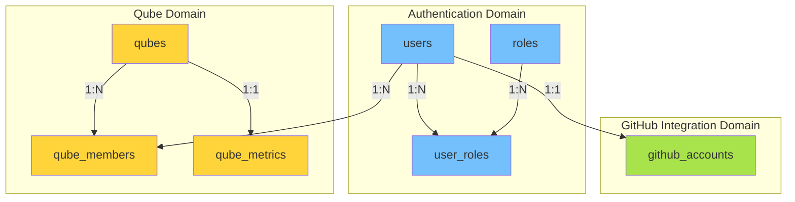

# JQUBE Server — Database Schema Documentation

## Table of Contents

1. [Overview](#overview)
2. [ER Diagram](#er-diagram)
3. [Table Reference](#table-reference)
   - [users](#users)
   - [roles](#roles)
   - [user_roles](#user_roles)
   - [github_accounts](#github_accounts)
   - [qubes](#qubes)
   - [qube_members](#qube_members)
   - [qube_metrics](#qube_metrics)
4. [Migration History](#migration-history)
5. [Indexes](#indexes)
6. [Relationships](#relationships)


## Overview

The JQUBE Server database uses **PostgreSQL** with **Flyway** for schema migrations. All tables use `UUID` primary keys generated via `gen_random_uuid()` (requires `pgcrypto` extension). Soft deletes are implemented via `is_deleted` and `deleted_at` columns across all tables.

### Quick Facts

| Property | Value |
|---|---|
| Database | PostgreSQL 15+ |
| Migration Tool | Flyway 10.1.0 |
| Primary Key Type | UUID (`gen_random_uuid()`) |
| Schema Management | Flyway-managed, Hibernate validates only (`ddl-auto: validate`) |
| Total Tables | 7 |
| Total Migrations | 8 (V1–V8) |
| Soft Delete | Yes (`is_deleted` + `deleted_at` on all tables) |
| Audit Fields | Yes (`created_at`, `updated_at`, `created_by`, `updated_by`) |


## ER Diagram

```mermaid
erDiagram
    users {
        uuid id PK
        varchar username UK
        varchar email UK
        varchar password
        varchar verification_code
        timestamp verification_expires_at
        boolean enabled
        boolean account_locked
        instant locked_until
        instant last_login_at
        integer failed_login_attempts
        timestamp created_at
        timestamp updated_at
        uuid created_by
        uuid updated_by
        timestamp deleted_at
        uuid deleted_by
        boolean is_deleted
    }

    roles {
        uuid id PK
        varchar name UK
        varchar description
        timestamp created_at
        timestamp updated_at
        uuid created_by
        uuid updated_by
        timestamp deleted_at
        uuid deleted_by
        boolean is_deleted
    }

    user_roles {
        uuid user_id PK,FK
        uuid role_id PK,FFK
    }

    github_accounts {
        uuid id PK
        uuid user_id UK,FK
        bigint github_id UK
        varchar username
        varchar name
        varchar email
        varchar avatar_url
        varchar profile_url
        varchar bio
        varchar company
        varchar blog
        varchar location
        integer public_repos
        integer followers
        integer following
        varchar encrypted_access_token
        varchar encrypted_refresh_token
        varchar token_type
        varchar scope
        timestamp access_token_expires_at
        timestamp refresh_token_expires_at
        timestamp last_synced_at
        timestamp created_at
        timestamp updated_at
        uuid created_by FK
        uuid updated_by FK
        timestamp deleted_at
        uuid deleted_by FK
        boolean is_deleted
    }

    qubes {
        uuid id PK
        varchar name
        varchar slug UK
        text description
        bigint github_repository_id
        varchar github_node_id
        varchar repository_owner
        varchar repository_name
        varchar repository_full_name
        varchar default_branch
        varchar target_branch
        varchar clone_url
        varchar html_url
        boolean private_repository
        varchar workspace_path
        boolean webhook_enabled
        boolean auto_scan_enabled
        boolean ai_remediation_enabled
        boolean archived
        timestamp created_at
        timestamp updated_at
        uuid created_by FK
        uuid updated_by FK
        timestamp deleted_at
        uuid deleted_by FK
        boolean is_deleted
    }

    qube_members {
        uuid id PK
        uuid qube_id FK
        uuid user_id FK
        varchar role
        boolean invitation_accepted
        boolean active
        timestamp invited_at
        timestamp joined_at
        uuid invited_by FK
        timestamp created_at
        timestamp updated_at
        uuid created_by FK
        uuid updated_by FK
        timestamp deleted_at
        uuid deleted_by FK
        boolean is_deleted
    }

    qube_metrics {
        uuid id PK
        uuid qube_id UK,FK
        uuid latest_scan_id
        bigint total_scans
        bigint successful_scans
        bigint failed_scans
        bigint cancelled_scans
        bigint queued_scans
        bigint total_findings
        bigint open_findings
        bigint resolved_findings
        bigint suppressed_findings
        bigint critical_findings
        bigint high_findings
        bigint medium_findings
        bigint low_findings
        bigint info_findings
        bigint ai_remediations_generated
        bigint pull_requests_created
        bigint merged_pull_requests
        bigint average_scan_duration_ms
        bigint fastest_scan_duration_ms
        bigint slowest_scan_duration_ms
        double precision security_score
        double precision risk_score
        timestamp created_at
        timestamp updated_at
        uuid created_by FK
        uuid updated_by FK
        timestamp deleted_at
        uuid deleted_by FK
        boolean is_deleted
    }

    users ||--o{ user_roles : "has"
    users ||--o| github_accounts : "has"
    roles ||--o{ user_roles : "assigned to"
    qubes ||--o{ qube_members : "contains"
    qubes ||--o| qube_metrics : "has"
    users ||--o{ qube_members : "is member of"
    users ||--o{ qube_members : "invited by"
```


## Table Reference

### users

The central authentication table. Stores user credentials, verification state, and lockout information. Implements Spring Security's `UserDetails` interface.

| Column | Type | Constraints | Default | Description |
|---|---|---|---|---|
| `id` | UUID | PRIMARY KEY | `gen_random_uuid()` | Unique user identifier |
| `username` | VARCHAR(50) | NOT NULL, UNIQUE | — | Login username |
| `email` | VARCHAR(150) | NOT NULL, UNIQUE | — | User email address |
| `password` | VARCHAR(255) | NOT NULL | — | BCrypt-hashed password |
| `verification_code` | VARCHAR(10) | NULLABLE | — | 6-digit email verification code |
| `verification_expires_at` | TIMESTAMP | NULLABLE | — | Code expiry timestamp (15 min TTL) |
| `enabled` | BOOLEAN | NOT NULL | `FALSE` | Account activation status |
| `account_locked` | BOOLEAN | NOT NULL | `FALSE` | Lockout status |
| `locked_until` | INSTANT | NULLABLE | — | Lock expiry timestamp |
| `last_login_at` | INSTANT | NULLABLE | — | Last successful login timestamp |
| `failed_login_attempts` | INTEGER | NOT NULL | `0` | Consecutive failed login count |
| `created_at` | TIMESTAMP | NOT NULL | `CURRENT_TIMESTAMP` | Record creation time |
| `updated_at` | TIMESTAMP | NULLABLE | — | Last update time |
| `created_by` | UUID | NULLABLE, FK → users.id | — | Creator user ID |
| `updated_by` | UUID | NULLABLE, FK → users.id | — | Last updater user ID |
| `deleted_at` | TIMESTAMP | NULLABLE | — | Soft delete timestamp |
| `deleted_by` | UUID | NULLABLE, FK → users.id | — | Deleter user ID |
| `is_deleted` | BOOLEAN | NOT NULL | `FALSE` | Soft delete flag |

**Indexes:**
- `idx_users_username` on `username`
- `idx_users_email` on `email`

**JPA Entity:** `net.jqube.server.models.auth.User`


### roles

Defines RBAC roles. Seeded with three default roles on application startup via `RoleSeeder`.

| Column | Type | Constraints | Default | Description |
|---|---|---|---|---|
| `id` | UUID | PRIMARY KEY | `gen_random_uuid()` | Unique role identifier |
| `name` | VARCHAR(50) | NOT NULL, UNIQUE | — | Role name (e.g., `ROLE_ADMIN`) |
| `description` | VARCHAR(255) | NOT NULL | — | Human-readable role description |
| `created_at` | TIMESTAMP | NOT NULL | `CURRENT_TIMESTAMP` | Record creation time |
| `updated_at` | TIMESTAMP | NULLABLE | — | Last update time |
| `created_by` | UUID | NULLABLE, FK → users.id | — | Creator user ID |
| `updated_by` | UUID | NULLABLE, FK → users.id | — | Last updater user ID |
| `deleted_at` | TIMESTAMP | NULLABLE | — | Soft delete timestamp |
| `deleted_by` | UUID | NULLABLE, FK → users.id | — | Deleter user ID |
| `is_deleted` | BOOLEAN | NOT NULL | `FALSE` | Soft delete flag |

**Indexes:**
- `idx_roles_name` on `name`

**Default Roles (seeded in V4):**
| Role Name | Description |
|---|---|
| `ROLE_ADMIN` | Administrator role with full access |
| `ROLE_USER` | Standard user role |
| `ROLE_VIEWER` | Read-only user role |

**JPA Entity:** `net.jqube.server.models.auth.Role`


### user_roles

Join table for the many-to-many relationship between `users` and `roles`.

| Column | Type | Constraints | Description |
|---|---|---|---|
| `user_id` | UUID | PK, FK → users.id ON DELETE CASCADE | User identifier |
| `role_id` | UUID | PK, FK → roles.id ON DELETE CASCADE | Role identifier |

**Indexes:**
- `idx_user_roles_user` on `user_id`
- `idx_user_roles_role` on `role_id`

**JPA Mapping:** `@ManyToMany` in `User.roles` via `@JoinTable(name = "user_roles")`


### github_accounts

Stores linked GitHub account information for users. OAuth tokens are stored encrypted using AES-256-GCM.

| Column | Type | Constraints | Default | Description |
|---|---|---|---|---|
| `id` | UUID | PRIMARY KEY | `gen_random_uuid()` | Unique account identifier |
| `user_id` | UUID | NOT NULL, UNIQUE, FK → users.id ON DELETE CASCADE | — | Associated JQUBE user |
| `github_id` | BIGINT | NOT NULL, UNIQUE | — | GitHub user ID |
| `username` | VARCHAR(100) | NOT NULL | — | GitHub username |
| `name` | VARCHAR(255) | NULLABLE | — | Display name |
| `email` | VARCHAR(150) | NULLABLE | — | GitHub email |
| `avatar_url` | VARCHAR(1000) | NULLABLE | — | Avatar image URL |
| `profile_url` | VARCHAR(1000) | NULLABLE | — | GitHub profile URL |
| `bio` | VARCHAR(1000) | NULLABLE | — | User biography |
| `company` | VARCHAR(255) | NULLABLE | — | Company name |
| `blog` | VARCHAR(1000) | NULLABLE | — | Blog URL |
| `location` | VARCHAR(255) | NULLABLE | — | User location |
| `public_repos` | INTEGER | NULLABLE | — | Public repository count |
| `followers` | INTEGER | NULLABLE | — | Follower count |
| `following` | INTEGER | NULLABLE | — | Following count |
| `encrypted_access_token` | VARCHAR(5000) | NOT NULL | — | AES-256-GCM encrypted access token |
| `encrypted_refresh_token` | VARCHAR(5000) | NULLABLE | — | AES-256-GCM encrypted refresh token |
| `token_type` | VARCHAR(50) | NULLABLE | — | Token type (e.g., `bearer`) |
| `scope` | VARCHAR(1000) | NULLABLE | — | Granted scopes |
| `access_token_expires_at` | TIMESTAMP | NULLABLE | — | Access token expiry |
| `refresh_token_expires_at` | TIMESTAMP | NULLABLE | — | Refresh token expiry |
| `last_synced_at` | TIMESTAMP | NULLABLE | — | Last profile sync timestamp |
| `created_at` | TIMESTAMP | NOT NULL | `CURRENT_TIMESTAMP` | Record creation time |
| `updated_at` | TIMESTAMP | NULLABLE | — | Last update time |
| `created_by` | UUID | NULLABLE, FK → users.id | — | Creator user ID |
| `updated_by` | UUID | NULLABLE, FK → users.id | — | Last updater user ID |
| `deleted_at` | TIMESTAMP | NULLABLE | — | Soft delete timestamp |
| `deleted_by` | UUID | NULLABLE, FK → users.id | — | Deleter user ID |
| `is_deleted` | BOOLEAN | NOT NULL | `FALSE` | Soft delete flag |

**Indexes:**
- `idx_github_username` on `username`
- `idx_github_id` on `github_id`

**Foreign Keys:**
- `fk_github_account_user` → `users(id)` ON DELETE CASCADE
- `fk_github_created_by` → `users(id)`
- `fk_github_updated_by` → `users(id)`
- `fk_github_deleted_by` → `users(id)`

**JPA Entity:** `net.jqube.server.models.github.GithubAccount`


### qubes

Represents a security-scan workspace bound to a GitHub repository. This is the core domain entity for the Qube (security scan) feature.

| Column | Type | Constraints | Default | Description |
|---|---|---|---|---|
| `id` | UUID | PRIMARY KEY | `gen_random_uuid()` | Unique qube identifier |
| `name` | VARCHAR(150) | NOT NULL | — | Human-readable qube name |
| `slug` | VARCHAR(180) | NOT NULL, UNIQUE | — | URL-friendly slug |
| `description` | TEXT | NULLABLE | — | Quibe description |
| `github_repository_id` | BIGINT | NOT NULL | — | GitHub repository ID |
| `github_node_id` | VARCHAR(255) | NULLABLE | — | GitHub node ID |
| `repository_owner` | VARCHAR(255) | NOT NULL | — | GitHub repository owner |
| `repository_name` | VARCHAR(255) | NOT NULL | — | GitHub repository name |
| `repository_full_name` | VARCHAR(512) | NOT NULL | — | Full repo name (owner/repo) |
| `default_branch` | VARCHAR(100) | NOT NULL | — | Default branch name |
| `target_branch` | VARCHAR(100) | NOT NULL | — | Target branch for scans |
| `clone_url` | VARCHAR(1000) | NOT NULL | — | Git clone URL |
| `html_url` | VARCHAR(1000) | NOT NULL | — | GitHub HTML URL |
| `private_repository` | BOOLEAN | NOT NULL | — | Repository visibility flag |
| `workspace_path` | VARCHAR(1000) | NOT NULL | — | Workspace file path |
| `webhook_enabled` | BOOLEAN | NOT NULL | `TRUE` | GitHub webhook toggle |
| `auto_scan_enabled` | BOOLEAN | NOT NULL | `FALSE` | Automatic scan on push |
| `ai_remediation_enabled` | BOOLEAN | NOT NULL | `FALSE` | AI-powered fix suggestions |
| `archived` | BOOLEAN | NOT NULL | `FALSE` | Archive status |
| `created_at` | TIMESTAMP | NOT NULL | `CURRENT_TIMESTAMP` | Record creation time |
| `updated_at` | TIMESTAMP | NULLABLE | — | Last update time |
| `created_by` | UUID | NULLABLE, FK → users.id | — | Creator user ID |
| `updated_by` | UUID | NULLABLE, FK → users.id | — | Last updater user ID |
| `deleted_at` | TIMESTAMP | NULLABLE | — | Soft delete timestamp |
| `deleted_by` | UUID | NULLABLE, FK → users.id | — | Deleter user ID |
| `is_deleted` | BOOLEAN | NOT NULL | `FALSE` | Soft delete flag |

**Indexes:**
- `idx_qube_slug` on `slug`
- `idx_qube_repo` on `github_repository_id`
- `idx_qube_full_name` on `repository_full_name`

**JPA Entity:** `net.jqube.server.models.qube.Qube`


### qube_members

Join table representing membership in a qube with role-based permissions within that qube.

| Column | Type | Constraints | Default | Description |
|---|---|---|---|---|
| `id` | UUID | PRIMARY KEY | `gen_random_uuid()` | Unique membership identifier |
| `qube_id` | UUID | NOT NULL, FK → qubes.id ON DELETE CASCADE | — | Parent qube |
| `user_id` | UUID | NOT NULL, FK → users.id ON DELETE CASCADE | — | Member user |
| `role` | VARCHAR(50) | NOT NULL | — | Member role (OWNER, MAINTAINER, CONTRIBUTOR, SECURITY_REVIEWER, VIEWER) |
| `invitation_accepted` | BOOLEAN | NOT NULL | `FALSE` | Whether invitation was accepted |
| `active` | BOOLEAN | NOT NULL | `TRUE` | Membership active status |
| `invited_at` | TIMESTAMP | NULLABLE | — | Invitation timestamp |
| `joined_at` | TIMESTAMP | NULLABLE | — | Acceptance timestamp |
| `invited_by` | UUID | NULLABLE, FK → users.id | — | Inviter user ID |
| `created_at` | TIMESTAMP | NOT NULL | `CURRENT_TIMESTAMP` | Record creation time |
| `updated_at` | TIMESTAMP | NULLABLE | — | Last update time |
| `created_by` | UUID | NULLABLE, FK → users.id | — | Creator user ID |
| `updated_by` | UUID | NULLABLE, FK → users.id | — | Last updater user ID |
| `deleted_at` | TIMESTAMP | NULLABLE | — | Soft delete timestamp |
| `deleted_by` | UUID | NULLABLE, FK → users.id | — | Deleter user ID |
| `is_deleted` | BOOLEAN | NOT NULL | `FALSE` | Soft delete flag |

**Constraints:**
- `uk_qube_member` UNIQUE (`qube_id`, `user_id`)

**Indexes:**
- `idx_qube_member_qube` on `qube_id`
- `idx_qube_member_user` on `user_id`
- `idx_qube_member_role` on `role`

**JPA Entity:** `net.jqube.server.models.qube.QubeMember`


### qube_metrics

Tracks aggregated security metrics for each qube. Updated by scan processes.

| Column | Type | Constraints | Default | Description |
|---|---|---|---|---|
| `id` | UUID | PRIMARY KEY | `gen_random_uuid()` | Unique metrics identifier |
| `qube_id` | UUID | NOT NULL, UNIQUE, FK → qubes.id ON DELETE CASCADE | — | Parent qube |
| `latest_scan_id` | UUID | NULLABLE | — | ID of most recent scan |
| `total_scans` | BIGINT | NOT NULL | `0` | Total scan count |
| `successful_scans` | BIGINT | NOT NULL | `0` | Successful scans |
| `failed_scans` | BIGINT | NOT NULL | `0` | Failed scans |
| `cancelled_scans` | BIGINT | NOT NULL | `0` | Cancelled scans |
| `queued_scans` | BIGINT | NOT NULL | `0` | Queued scans |
| `total_findings` | BIGINT | NOT NULL | `0` | Total findings |
| `open_findings` | BIGINT | NOT NULL | `0` | Open findings |
| `resolved_findings` | BIGINT | NOT NULL | `0` | Resolved findings |
| `suppressed_findings` | BIGINT | NOT NULL | `0` | Suppressed findings |
| `critical_findings` | BIGINT | NOT NULL | `0` | Critical severity findings |
| `high_findings` | BIGINT | NOT NULL | `0` | High severity findings |
| `medium_findings` | BIGINT | NOT NULL | `0` | Medium severity findings |
| `low_findings` | BIGINT | NOT NULL | `0` | Low severity findings |
| `info_findings` | BIGINT | NOT NULL | `0` | Informational findings |
| `ai_remediations_generated` | BIGINT | NOT NULL | `0` | AI-generated fixes |
| `pull_requests_created` | BIGINT | NOT NULL | `0` | PRs created |
| `merged_pull_requests` | BIGINT | NOT NULL | `0` | Merged PRs |
| `average_scan_duration_ms` | BIGINT | NOT NULL | `0` | Avg scan duration |
| `fastest_scan_duration_ms` | BIGINT | NOT NULL | `0` | Fastest scan |
| `slowest_scan_duration_ms` | BIGINT | NOT NULL | `0` | Slowest scan |
| `security_score` | DOUBLE PRECISION | NOT NULL | `100` | Security health score |
| `risk_score` | DOUBLE PRECISION | NOT NULL | `0` | Risk assessment score |
| `created_at` | TIMESTAMP | NOT NULL | `CURRENT_TIMESTAMP` | Record creation time |
| `updated_at` | TIMESTAMP | NULLABLE | — | Last update time |
| `created_by` | UUID | NULLABLE, FK → users.id | — | Creator user ID |
| `updated_by` | UUID | NULLABLE, FK → users.id | — | Last updater user ID |
| `deleted_at` | TIMESTAMP | NULLABLE | — | Soft delete timestamp |
| `deleted_by` | UUID | NULLABLE, FK → users.id | — | Deleter user ID |
| `is_deleted` | BOOLEAN | NOT NULL | `FALSE` | Soft delete flag |

**Indexes:**
- `idx_qube_metrics_qube` (UNIQUE) on `qube_id`

**JPA Entity:** `net.jqube.server.models.qube.QubeMetrics`


## Migration History

| Version | File | Description |
|---|---|---|
| V1 | `V1__Create_Users_Table.sql` | Creates `users` table with authentication fields, audit columns |
| V2 | `V2__Create_Roles_Table.sql` | Creates `roles` table for RBAC |
| V3 | `V3__Create_User_Roles_Table.sql` | Creates `user_roles` join table (many-to-many) |
| V4 | `V4__Insert_Default_Roles.sql` | Seeds `ROLE_ADMIN`, `ROLE_USER`, `ROLE_VIEWER` |
| V5 | `V5__Create_Github_Accounts_Table.sql` | Creates `github_accounts` for OAuth token storage |
| V6 | `V6__Create_Qubes_Table.sql` | Creates `qubes` for security-scan workspaces |
| V7 | `V7__Create_Qube_Members_Table.sql` | Creates `qube_members` for workspace membership |
| V8 | `V8__Create_Qube_Metrics_Table.sql` | Creates `qube_metrics` for scan statistics |


## Indexes

All indexes are created within their respective migration files:

| Table | Index Name | Columns | Type |
|---|---|---|---|
| `users` | `idx_users_username` | `username` | B-tree |
| `users` | `idx_users_email` | `email` | B-tree |
| `roles` | `idx_roles_name` | `name` | B-tree |
| `user_roles` | `idx_user_roles_user` | `user_id` | B-tree |
| `user_roles` | `idx_user_roles_role` | `role_id` | B-tree |
| `github_accounts` | `idx_github_username` | `username` | B-tree |
| `github_accounts` | `idx_github_id` | `github_id` | B-tree |
| `qubes` | `idx_qube_slug` | `slug` | B-tree |
| `qubes` | `idx_qube_repo` | `github_repository_id` | B-tree |
| `qubes` | `idx_qube_full_name` | `repository_full_name` | B-tree |
| `qube_members` | `idx_qube_member_qube` | `qube_id` | B-tree |
| `qube_members` | `idx_qube_member_user` | `user_id` | B-tree |
| `qube_members` | `idx_qube_member_role` | `role` | B-tree |
| `qube_metrics` | `idx_qube_metrics_qube` | `qube_id` | B-tree (UNIQUE) |


## Relationships



### Relationship Details

| From | To | Type | Join Condition | On Delete |
|---|---|---|---|---|
| `users` | `user_roles` | One-to-Many | `users.id = user_roles.user_id` | CASCADE |
| `roles` | `user_roles` | One-to-Many | `roles.id = user_roles.role_id` | CASCADE |
| `users` | `github_accounts` | One-to-One | `users.id = github_accounts.user_id` | CASCADE |
| `users` | `github_accounts` | One-to-One (inverse) | `users.id = github_accounts.created_by` | RESTRICT |
| `users` | `qubes` | One-to-Many (as creator) | `users.id = qubes.created_by` | RESTRICT |
| `qubes` | `qube_members` | One-to-Many | `qubes.id = qube_members.qube_id` | CASCADE |
| `users` | `qube_members` | One-to-Many (as member) | `users.id = qube_members.user_id` | CASCADE |
| `users` | `qube_members` | One-to-Many (as inviter) | `users.id = qube_members.invited_by` | RESTRICT |
| `qubes` | `qube_metrics` | One-to-One | `qubes.id = qube_metrics.qube_id` | CASCADE |
