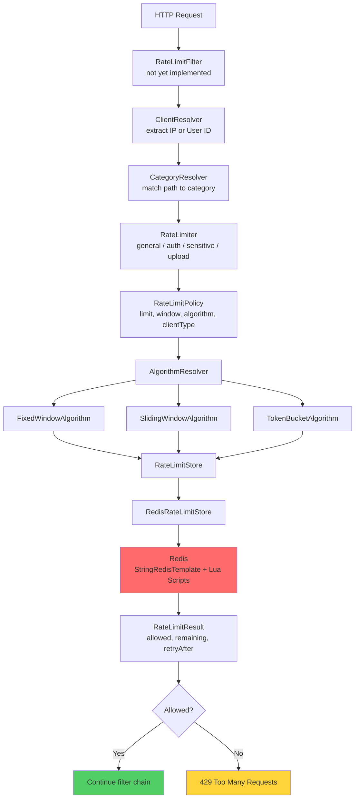
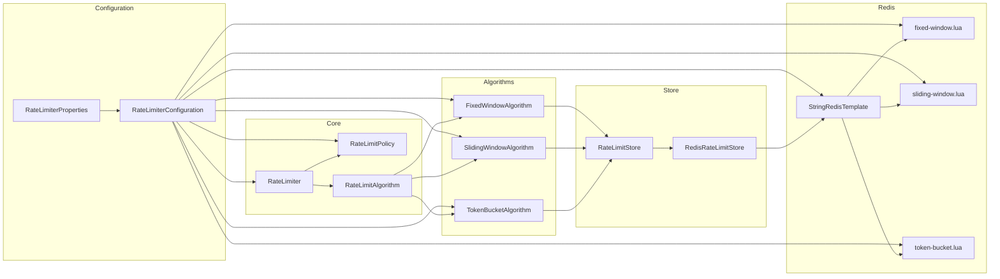
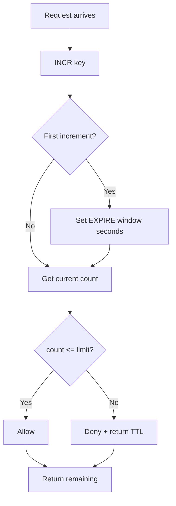
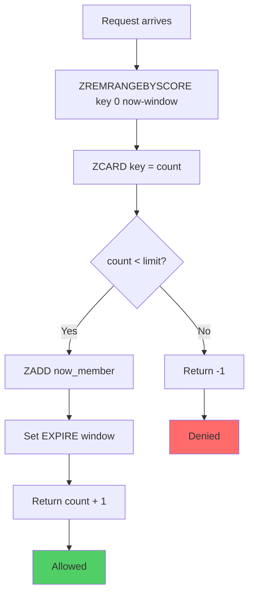
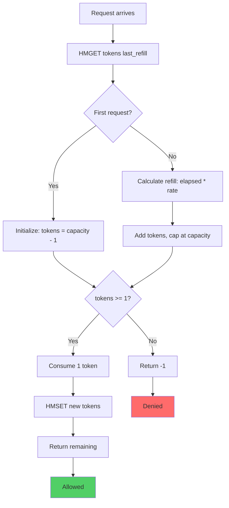
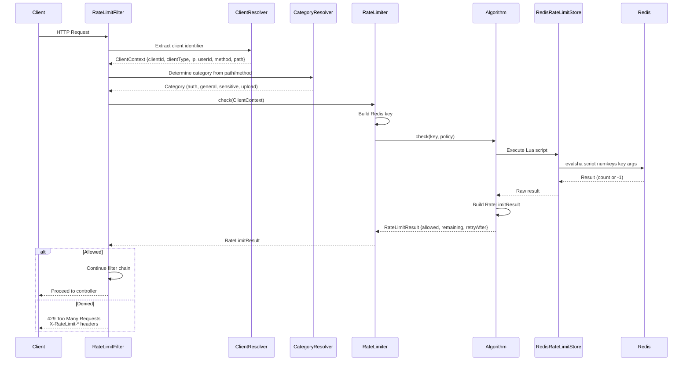
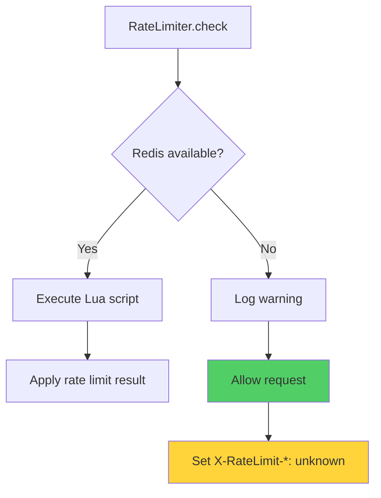
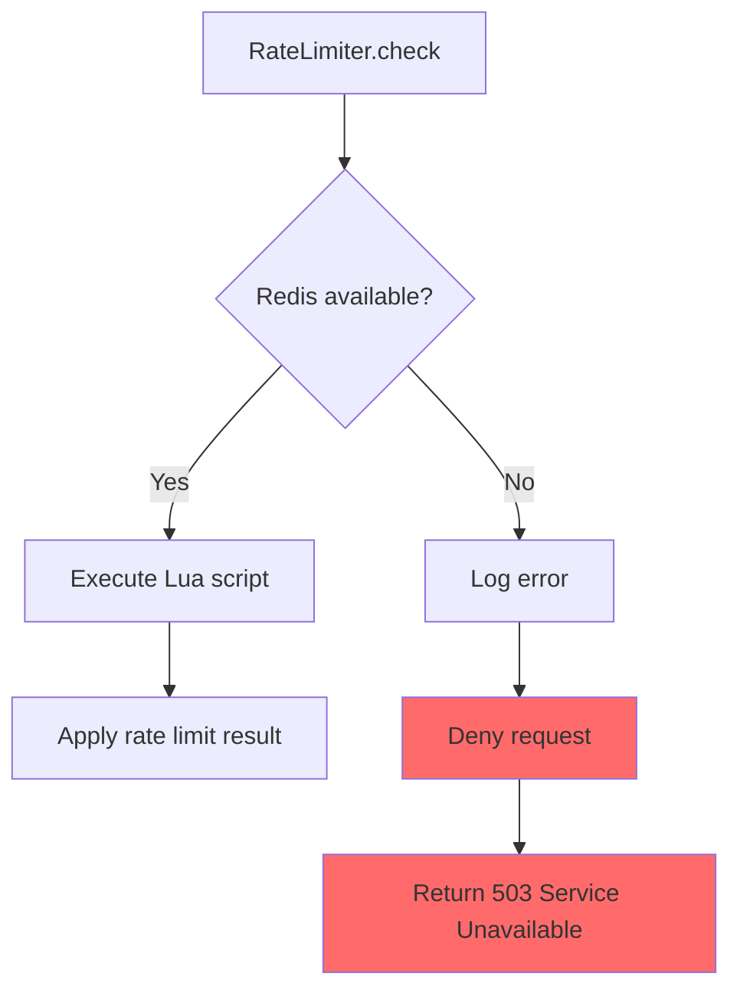

# JQube Server — Rate Limiter Policies & Implementation

## Table of Contents

1. [Overview](#overview)
2. [Architecture](#architecture)
3. [Rate Limiting Policies](#rate-limiting-policies)
4. [Algorithms](#algorithms)
5. [Lua Scripts](#lua-scripts)
6. [Redis Data Structures](#redis-data-structures)
7. [Configuration Reference](#configuration-reference)
8. [Request Flow](#request-flow)
9. [Fail Modes](#fail-modes)
10. [Integration Guide](#integration-guide)
11. [Performance Considerations](#performance-considerations)

---

## Overview

The rate limiter protects JQUBE Server endpoints from abuse, brute-force attacks, and resource exhaustion. It uses *
*Redis** as a distributed store with **Lua scripts** for atomic operations, supporting three algorithms: Fixed Window,
Sliding Window, and Token Bucket.

### Key Features

- **Distributed** — Works across multiple server instances via Redis
- **Pluggable algorithms** — Fixed Window, Sliding Window, Token Bucket
- **Category-based policies** — Separate limits for auth, general, sensitive, and upload endpoints
- **Client-type aware** — Rate limit by IP address or authenticated user ID
- **Fail-safe modes** — OPEN (allow on Redis failure) or CLOSED (deny on Redis failure)
- **Lua-atomic** — All checks are atomic Redis Lua scripts, preventing race conditions

---

## Architecture



### Component Diagram



---

## Rate Limiting Policies

Four category-based policies are defined, each with its own limit, window, algorithm, and client-type scope.

### Policy Comparison

| Category    | Purpose                            | Limit        | Window     | Algorithm    | Client Type |
|-------------|------------------------------------|--------------|------------|--------------|-------------|
| `general`   | Default for unclassified endpoints | 100 requests | 60 seconds | FIXED_WINDOW | IP          |
| `auth`      | Login, register, verify endpoints  | 10 requests  | 60 seconds | FIXED_WINDOW | IP          |
| `sensitive` | Admin operations, role changes     | 20 requests  | 60 seconds | FIXED_WINDOW | USER        |
| `upload`    | File uploads, large payloads       | 20 requests  | 60 seconds | FIXED_WINDOW | USER        |

### Policy Configuration

```yaml
rate-limiter:
  enabled: true
  fail-mode: OPEN

  general:
    limit: 100
    window: 60s
    algorithm: FIXED_WINDOW
    client-type: IP

  auth:
    limit: 10
    window: 60s
    algorithm: FIXED_WINDOW
    client-type: IP

  sensitive:
    limit: 20
    window: 60s
    algorithm: FIXED_WINDOW
    client-type: USER

  upload:
    limit: 20
    window: 60s
    algorithm: FIXED_WINDOW
    client-type: USER
```

### Rate Limit Key Format

Each rate limit check generates a Redis key:

```
rl:{category}:{clientType}:{clientId}
```

Examples:

```
rl:general:ip:192.168.1.1
rl:auth:ip:10.0.0.5
rl:sensitive:user:550e8400-e29b-41d4-a716-446655440000
rl:upload:user:550e8400-e29b-41d4-a716-446655440000
```

---

## Algorithms

### Fixed Window



**Characteristics:**

- Simple counter per time window
- Burst at window boundary possible
- Lowest Redis memory usage
- Best for: High-volume, non-critical endpoints

**Lua execution:** `fixed-window.lua` → `INCR` + `EXPIRE`

---

### Sliding Window



**Characteristics:**

- Uses sorted set (ZSET) with timestamps
- Smooth rate limiting across window boundaries
- Higher Redis memory usage (stores timestamps)
- Best for: APIs where burst-at-boundary is unacceptable

**Lua execution:** `sliding-window.lua` → `ZREMRANGEBYSCORE` + `ZCARD` + `ZADD`

---

### Token Bucket



**Characteristics:**

- Allows controlled bursts up to capacity
- Smooth refill over time
- Highest Redis memory usage (hash with 2 fields)
- Best for: APIs needing burst tolerance

**Lua execution:** `token-bucket.lua` → `HMGET` + `HMSET`

---

## Lua Scripts

All rate limiting logic runs inside Redis Lua scripts for atomicity. This prevents race conditions when multiple
requests arrive simultaneously.

### fixed-window.lua

```lua
local key = KEYS[1]
local window = tonumber(ARGV[1])

local current = redis.call('INCR', key)
if current == 1 then
    redis.call('EXPIRE', key, window)
end
return current
```

**Behavior:**

- `INCR` the counter key
- If first increment, set TTL to window duration
- Returns the new count

**Redis commands used:** `INCR`, `EXPIRE`

**Memory:** O(1) per key (single string value)

---

### sliding-window.lua

```lua
local key = KEYS[1]
local window = tonumber(ARGV[1])
local limit = tonumber(ARGV[2])
local now = tonumber(ARGV[3])

local clear_before = now - (window * 1000)

redis.call('ZREMRANGEBYSCORE', key, 0, clear_before)

local count = redis.call('ZCARD', key)

if count < limit then
    local member = now .. '_' .. math.random(1, 1000000)
    redis.call('ZADD', key, now, member)
    redis.call('EXPIRE', key, window)
    return count + 1
else
    return -1
end
```

**Behavior:**

- Remove entries older than window from sorted set
- Count remaining entries
- If under limit, add current timestamp and allow
- Returns new count or -1 if denied

**Redis commands used:** `ZREMRANGEBYSCORE`, `ZCARD`, `ZADD`, `EXPIRE`

**Memory:** O(n) per key where n = number of requests in window

---

### token-bucket.lua

```lua
local key = KEYS[1]
local capacity = tonumber(ARGV[1])
local refill_rate = tonumber(ARGV[2])
local now = tonumber(ARGV[3])
local ttl = tonumber(ARGV[4])

local data = redis.call('HMGET', key, 'tokens', 'last_refill')
local tokens = tonumber(data[1])
local last_refill = tonumber(data[2])

if not tokens then
    tokens = capacity - 1
    last_refill = now
    redis.call('HMSET', key, 'tokens', tokens, 'last_refill', last_refill)
    redis.call('EXPIRE', key, ttl)
    return math.floor(tokens)
else
    local elapsed = (now - last_refill) / 1000.0
    local tokens_to_add = elapsed * refill_rate
    tokens = tokens + tokens_to_add

    if tokens > capacity then
        tokens = capacity
    end

    if tokens >= 1 then
        tokens = tokens - 1
        redis.call('HMSET', key, 'tokens', tokens, 'last_refill', now)
        redis.call('EXPIRE', key, ttl)
        return math.floor(tokens)
    else
        return -1
    end
end
```

**Behavior:**

- Retrieve `tokens` and `last_refill` from hash
- Calculate tokens to add based on elapsed time
- Cap at capacity
- If tokens >= 1, consume one and return remaining
- Returns remaining tokens or -1 if denied

**Redis commands used:** `HMGET`, `HMSET`, `EXPIRE`

**Memory:** O(1) per key (hash with 2 fields)

---

## Redis Data Structures

| Algorithm      | Redis Key Type | Fields / Members          | TTL             |
|----------------|----------------|---------------------------|-----------------|
| Fixed Window   | String         | Counter value             | Window duration |
| Sliding Window | Sorted Set     | Timestamp + random suffix | Window duration |
| Token Bucket   | Hash           | `tokens`, `last_refill`   | Window duration |

### Key Naming Convention

```
rl:{category}:{clientType}:{clientId}
```

Where:

- `category` — `general`, `auth`, `sensitive`, `upload`
- `clientType` — `ip`, `user`
- `clientId` — IP address (e.g., `192.168.1.1`) or user UUID (e.g., `550e8400-e29b...`)

---

## Configuration Reference

### Properties

| Property                              | Type     | Default        | Description                           |
|---------------------------------------|----------|----------------|---------------------------------------|
| `rate-limiter.enabled`                | Boolean  | `true`         | Enable/disable rate limiting globally |
| `rate-limiter.fail-mode`              | Enum     | `OPEN`         | Behavior when Redis is unavailable    |
| `rate-limiter.{category}.limit`       | Integer  | —              | Max requests per window               |
| `rate-limiter.{category}.window`      | Duration | `60s`          | Time window for limit                 |
| `rate-limiter.{category}.algorithm`   | Enum     | `FIXED_WINDOW` | Algorithm to use                      |
| `rate-limiter.{category}.client-type` | Enum     | `IP`           | Whether to key by IP or user          |

### Enums

#### AlgorithmType

| Value            | Description                            |
|------------------|----------------------------------------|
| `FIXED_WINDOW`   | Simple counter, best performance       |
| `SLIDING_WINDOW` | Smooth windowing, no burst at boundary |
| `TOKEN_BUCKET`   | Burst-friendly, gradual refill         |

#### ClientType

| Value  | Description                         |
|--------|-------------------------------------|
| `IP`   | Rate limit by client IP address     |
| `USER` | Rate limit by authenticated user ID |

#### FailMode

| Value    | Description                                    |
|----------|------------------------------------------------|
| `OPEN`   | Allow requests when Redis is down (fail open)  |
| `CLOSED` | Deny requests when Redis is down (fail closed) |

---

## Request Flow



---

## Fail Modes

### OPEN Mode (Default)



### CLOSED Mode



---

## Integration Guide

### Step 1: Add Redis Dependency

Already included in `pom.xml`:

```xml

<dependency>
    <groupId>org.springframework.boot</groupId>
    <artifactId>spring-boot-starter-data-redis</artifactId>
</dependency>
```

### Step 2: Configure Redis

Add to `.env`:

```env
REDIS_HOST=localhost
REDIS_PORT=6379
```

### Step 3: Configure Rate Limiter

Edit `application.yml`:

```yaml
rate-limiter:
  enabled: true
  fail-mode: OPEN
  auth:
    limit: 10
    window: 60s
    algorithm: FIXED_WINDOW
    client-type: IP
```

### Step 4: Add RateLimitFilter to Security Chain

Add to `SecurityConfiguration`:

```java

@Bean
public SecurityFilterChain securityFilterChain(HttpSecurity http, RateLimitFilter rateLimitFilter) throws Exception {
    http
            .addFilterBefore(rateLimitFilter, RequestLoggingFilter.class)
    // ... rest of config
}
```

### Step 5: Map Endpoints to Categories

In `RateLimitFilter`:

```java
private String resolveCategory(HttpServletRequest request) {
    String path = request.getRequestURI();
    if (path.startsWith("/api/v1/auth")) return "auth";
    if (path.startsWith("/api/v1/admin")) return "sensitive";
    if (path.startsWith("/api/v1/github/connect")) return "upload";
    return "general";
}
```

---

## Performance Considerations

### Redis Connection Pool

`StringRedisTemplate` uses Lettuce (default) or Jedis. For high-throughput:

```yaml
spring:
  data:
    redis:
      lettuce:
        pool:
          max-active: 16
          max-idle: 8
          min-idle: 2
```

### Lua Script Caching

Redis caches Lua scripts by SHA1 hash after first execution. Subsequent calls use `EVALSHA` for lower latency.

### Memory Usage Estimates

| Algorithm      | Keys per Minute (100 req limit) | Approx Memory             |
|----------------|---------------------------------|---------------------------|
| Fixed Window   | 1 key per window                | ~1 KB per key             |
| Sliding Window | 1 key per window                | ~10 KB per key (ZSET)     |
| Token Bucket   | 1 key per window                | ~200 bytes per key (Hash) |

### Scaling

- Single Redis instance: ~100,000 rate limit checks/sec
- Redis Cluster: Horizontal scaling across shards
- Consider Redis Sentinel for HA
