# JQUBE API Server — Complete Architecture Documentation

## Table of Contents

1. [Project Overview](#project-overview)
2. [Architectural Goals](#architectural-goals)
3. [Architecture Style](#architecture-style)
4. [High-Level System Diagram](#high-level-system-diagram)
5. [Package Structure](#package-structure)
6. [Request Lifecycle](#request-lifecycle)
7. [Authentication Flow](#authentication-flow)
8. [Registration & Email Verification Flow](#registration--email-verification-flow)
9. [GitHub OAuth2 Flow](#github-oauth2-flow)
10. [Authorization Model](#authorization-model)
11. [Dependency Flow](#dependency-flow)
12. [Data Flow](#data-flow)
13. [Security Flow](#security-flow)
14. [Configuration Architecture](#configuration-architecture)
15. [Design Patterns](#design-patterns)
16. [SOLID Principles](#solid-principles)
17. [Technology Stack](#technology-stack)
18. [Database Schema Overview](#database-schema-overview)
19. [Future Scalability](#future-scalability)
20. [Architecture Decisions](#architecture-decisions)
21. [Code Organization](#code-organization)
22. [Strengths](#strengths)
23. [Possible Improvements](#possible-improvements)
24. [Development Guidelines](#development-guidelines)

## Project Overview

JQUBE API Server is a Spring Boot 3.2 / Java 17 backend providing JWT-based authentication, email-verified user
registration, role-based access control (RBAC), and GitHub account linking via a hand-rolled OAuth2 authorization-code
flow. This document describes **how the system is built**, with every claim derived directly from the source code in
`src/main/java/net/jqube/server`.

## Architectural Goals

Inferred from the code structure and choices actually made:

- **Statelessness** — no server-side session; every request carries its own JWT.
- **Separation of contract from implementation** — every business capability is exposed as a service *interface*,
  implemented separately, so controllers never depend on a concrete class.
- **Centralized, typed error handling** — a single `@RestControllerAdvice` maps ~15 distinct exception types to a
  consistent `ErrorResponse` envelope.
- **Defense against a specific, named threat** — the GitHub OAuth "state" parameter is a signed JWT rather than a raw
  user ID, explicitly to prevent account-hijack via state tampering (documented in the source code).

## Architecture Style

**Layered (N-Tier) Architecture.** The dependency direction is strictly one-way:

```
Controller → Service Interface → Service Implementation → Repository → Database
```

This is **not** Hexagonal/Clean Architecture: the `User` JPA entity directly implements Spring Security's `UserDetails`,
coupling the persistence model to the security framework. For a single-bounded-context authentication/authorization
service, this is an appropriate and low-friction choice. It would need to be unwound only if the domain model must ever
become framework-independent.

## High-Level System Diagram

```mermaid
flowchart TD
    A[Client] --> B[RequestLoggingFilter<br/>logs IP, method, URI, body]
    B --> C[Spring Security Filter Chain<br/>CORS → CSRF disabled → ...]
    C --> D[AuthenticationFilter<br/>Bearer JWT → SecurityContext]
    D --> E[authorizeHttpRequests<br/>path rules + HTTP-verb role rules + @PreAuthorize]
    E --> F[Controller<br/>@Valid triggers validation]
    F --> G[Service Interface]
    G --> H[Service Implementation<br/>business logic, @Transactional]
    H --> I[Repository Spring Data JPA]
    I --> J[(PostgreSQL)]
    H --> K[Response<T> / ErrorResponse]
    K --> L[JSON Response]
    L --> A
```

**Key architectural layers:**

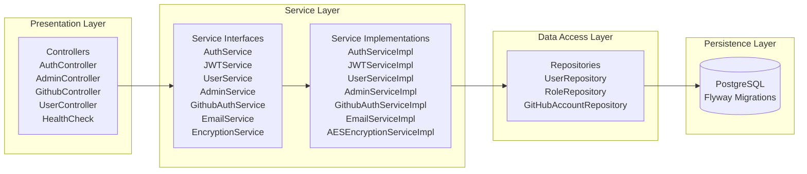

## Package Structure

```
net.jqube.server
├── controllers/        REST endpoints (Admin, Auth, GitHub, Health, User)
├── services/
│   ├── auth/            interfaces: AdminService, AuthService, EmailService, JWTService, UserService
│   ├── github/          interface: GithubAuthService, GithubRepoService (+ GithubStateManager, no interface)
│   └── impls/
│       ├── auth/        AdminServiceImpl, AuthServiceImpl, EmailServiceImpl, JWTServiceImpl, UserServiceImpl
│       ├── github/      GithubAuthServiceImpl, GithubRepoServiceImpl
│       ├── security/    AESEncryptionServiceImpl
│       └── shared/      EmailServiceImpl
├── repositories/        UserRepository, RoleRepository, GitHubAccountRepository
├── models/              User (implements UserDetails), Role, GithubAccount, Qube, QubeMember, QubeMetrics
├── dtos/
│   ├── auth/            LoginDTO, RegisterDTO, VerifyUserDTO, ResendCodeDTO, RoleDTO,
│   │                    UserProfileDTO, UserResponseDTO, RegistrationSuccessDTO
│   ├── github/          BranchCommitDTO, RepoResponseDTO, etc.
│   └── requests/        AssignRoleRequestDTO
├── responses/           Response<T>, ErrorResponse
│   └── dataDTOs/        LoginResponse, HealthResponse, GithubProfileResponse,
│                        GithubTokenResponse, GithubUserResponse
├── configs/             AppConfiguration, CORSConfiguration, OpenAPIConfiguration,
│                        RestClientConfiguration, SecurityConfiguration
│   └── properties/      EmailProperties (unused), GithubProperties, JWTProperties
├── constants/           GithubConstants (OAuth URLs, headers, scope)
├── enums/               QubeAuthorities, QubeRoles, SystemRoles
├── exceptions/          ~15 custom RuntimeException subclasses
│   ├── auth/            InvalidVerificationCodeException, RoleNotFoundException, etc.
│   └── shared/          EncryptionException, UserNotFoundException
├── filters/             AuthenticationFilter, RequestLoggingFilter
├── handlers/            GlobalExceptionHandler (@RestControllerAdvice)
├── utils/               RoleSeeder (CommandLineRunner)
└── JQubeServer.java     @SpringBootApplication entry point
```

**Package dependency visualization:**

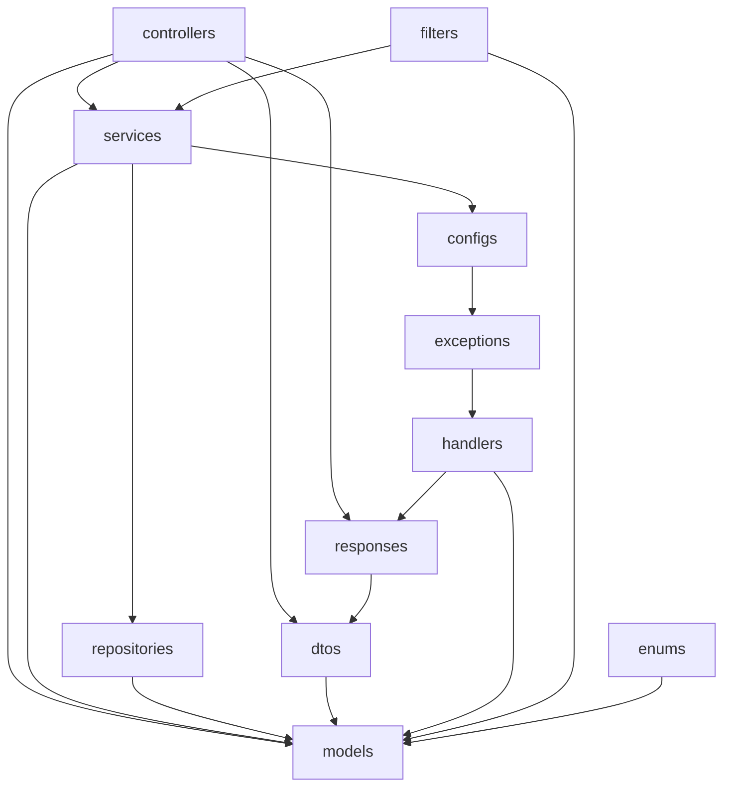

## Request Lifecycle

Every HTTP request flows through the following pipeline:

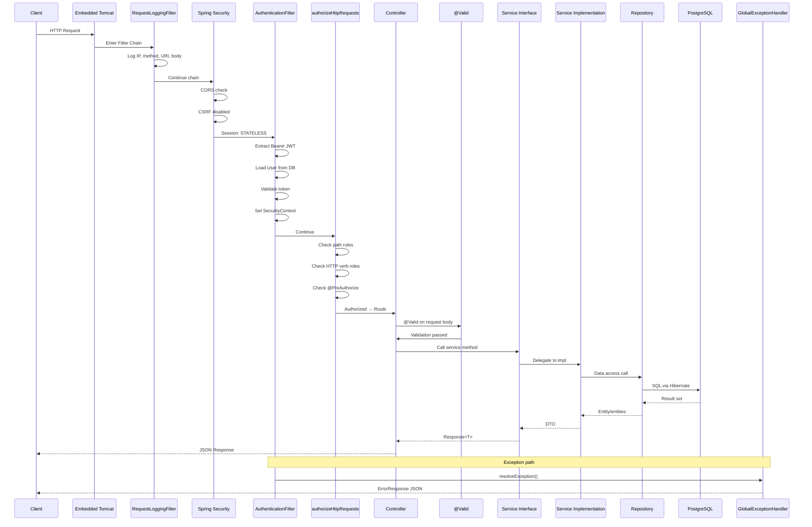

## Authentication Flow

### Step-by-Step Login Process

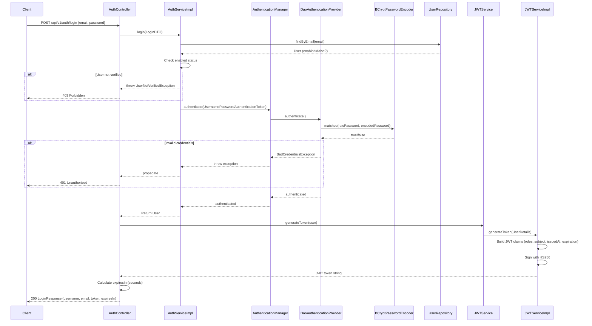

### JWT Structure

```mermaid
flowchart TD
    A[JWT Token] --> B[Header]
    A --> C[Payload Claims]
    A --> D[Signature]

    B --> B1[alg: HS256]
    B --> B2[typ: JWT]

    C --> C1[sub: username]
    C --> C2[roles: [ROLE_USER, ...]]
    C --> C3[iat: issued at timestamp]
    C --> C4[exp: expiration timestamp]

    D --> D1[HMAC-SHA256<br/>base64url(header) + '.' + base64url(payload)<br/>signed with JWT_SECRET_KEY]
```

### JWT Validation on Subsequent Requests

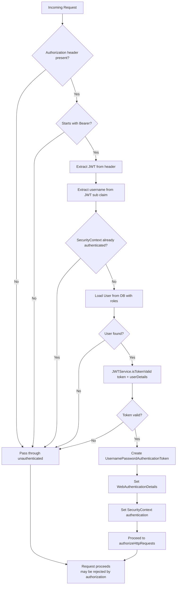

## Registration & Email Verification Flow

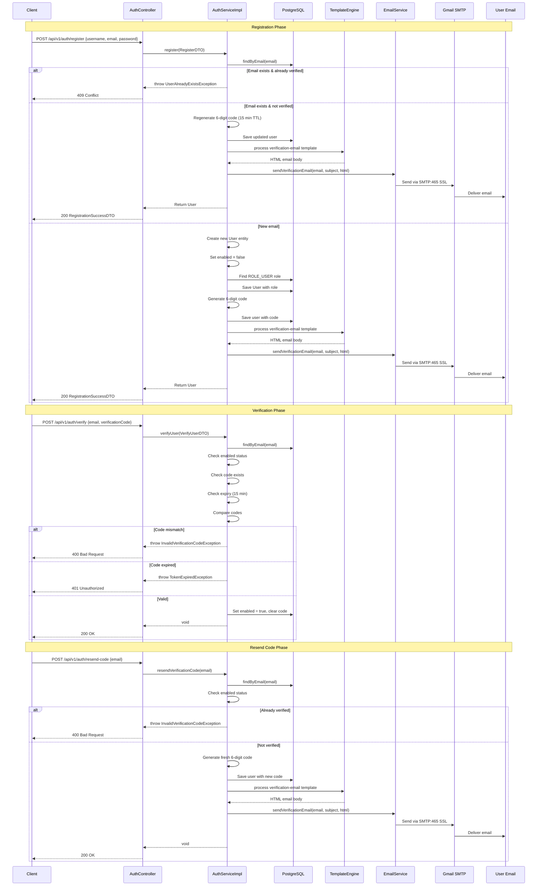

## GitHub OAuth2 Flow

### Complete Flow Diagram

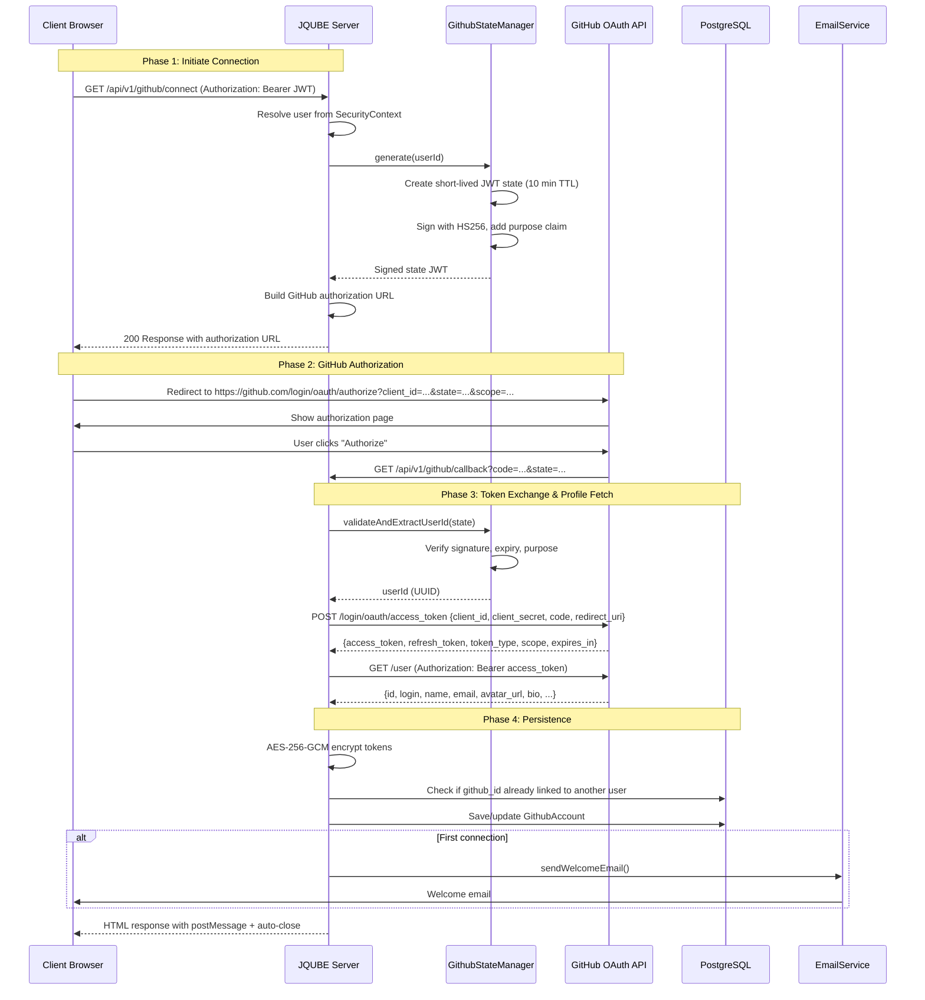

### State Protection Mechanism

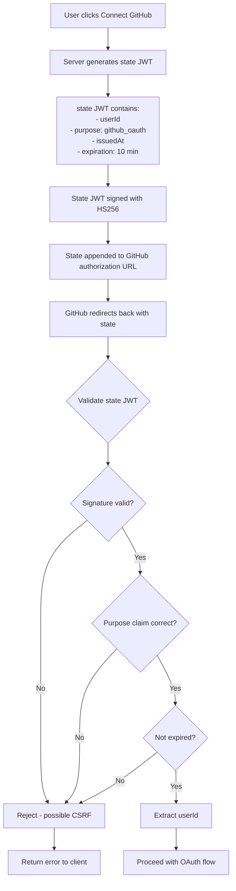

## Authorization Model

```mermaid
flowchart TD
    A[Incoming HTTP Request] --> B{Path matches public endpoint?}
    B -->|Yes| C[Permit All]
    B -->|No| D{Has Authorization header?}
    D -->|No| E[401 Unauthorized]
    D -->|Yes| F{Bearer token present?}
    F -->|No| E
    F -->|Yes| G[AuthenticationFilter validates JWT]
    G --> H{Token valid?}
    H -->|No| E
    H -->|Yes| I[Populate SecurityContext]
    I --> J{Check HTTP method}

    J -->|GET| K{Has ADMIN, USER, or VIEWER role?}
    J -->|POST| L{Has ADMIN or USER role?}
    J -->|PUT| L
    J -->|PATCH| M{Has ADMIN role?}
    J -->|DELETE| M

    K -->|Yes| N{@PreAuthorize check?}
    K -->|No| E
    L -->|Yes| N
    L -->|No| E
    M -->|Yes| N
    M -->|No| E

    N -->|Pass| O[Controller executes]
    N -->|Fail| E

    C --> P[Request proceeds]
    O --> P

    style E fill:#ff6b6b
    style C fill:#51cf66
    style O fill:#51cf66
```

### Authorization Rules Matrix

| Endpoint Pattern            | Method | Required Roles      | Notes                                |
|-----------------------------|--------|---------------------|--------------------------------------|
| `/api/v1/auth/**`           | ALL    | None                | Public (registration, login, verify) |
| `/health`                   | ALL    | None                | Health check                         |
| `/v3/api-docs/**`           | ALL    | None                | OpenAPI docs                         |
| `/swagger-ui/**`            | ALL    | None                | Swagger UI                           |
| `/api/v1/github/callback`   | GET    | None                | Public OAuth callback                |
| `/api/v1/github/disconnect` | DELETE | ADMIN, USER         | Verb-based rule                      |
| `/api/v1/github/**`         | GET    | ADMIN, USER, VIEWER | Verb-based rule                      |
| `/api/v1/admin/**`          | ALL    | ADMIN only          | @PreAuthorize on class               |
| `/api/v1/user/me`           | GET    | ADMIN, USER, VIEWER | @PreAuthorize on method              |
| Default fallback            | ALL    | Authenticated       | anyRequest().authenticated()         |

## Dependency Flow

```mermaid
flowchart LR
    subgraph "Controllers Layer"
        AC[AuthController]
        AdC[AdminController]
        GC[GithubController]
        UC[UserController]
        HC[HealthCheck]
    end

    subgraph "Service Interfaces"
        AS[AuthService]
        JS[JWTService]
        US[UserService]
        AdS[AdminService]
        GAS[GithubAuthService]
        ES[EmailService]
        EncS[EncryptionService]
    end

    subgraph "Service Implementations"
        ASI[AuthServiceImpl]
        JSI[JWTServiceImpl]
        USI[UserServiceImpl]
        AdSI[AdminServiceImpl]
        GASI[GithubAuthServiceImpl]
        ESI[EmailServiceImpl]
        EncSI[AESEncryptionServiceImpl]
    end

    subgraph "Repositories"
        UR[UserRepository]
        RR[RoleRepository]
        GHR[GitHubAccountRepository]
    end

    subgraph "Database"
        DB[(PostgreSQL)]
    end

    AC --> AS
    AC --> JS
    AdC --> AdS
    GC --> GAS
    UC --> US
    HC -->|none|

    AS --> ASI
    JS --> JSI
    US --> USI
    AdS --> AdSI
    GAS --> GASI
    ES --> ESI
    EncS --> EncSI

    ASI --> UR
    ASI --> RR
    ASI --> ES
    JSI -->|none|
    USI --> UR
    AdSI --> UR
    AdSI --> RR
    GASI --> UR
    GASI --> GHR
    GASI --> EncS
    GASI --> ES
    ESI -->|Spring Mail|
    EncSI -->|none|

    UR --> DB
    RR --> DB
    GHR --> DB
```

## Data Flow

### Entity to DTO Mapping

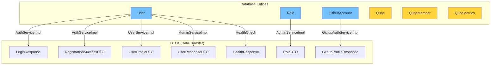

### Relationship Mapping Details

| Relationship         | Type         | Join Table / Column             | Notes                                 |
|----------------------|--------------|---------------------------------|---------------------------------------|
| User ↔ Role          | Many-to-Many | `user_roles` (user_id, role_id) | Lazy loaded                           |
| User → GithubAccount | One-to-One   | `github_accounts.user_id`       | Unique on both sides, CascadeType.ALL |
| Qube → QubeMember    | One-to-Many  | `qube_members.qube_id`          | ON DELETE CASCADE                     |
| Qube → QubeMetrics   | One-to-One   | `qube_metrics.qube_id`          | Unique constraint                     |
| User → QubeMember    | One-to-Many  | `qube_members.user_id`          | As member                             |
| User → QubeMember    | One-to-Many  | `qube_members.invited_by`       | As inviter                            |

## Security Flow

### Password Storage & Verification

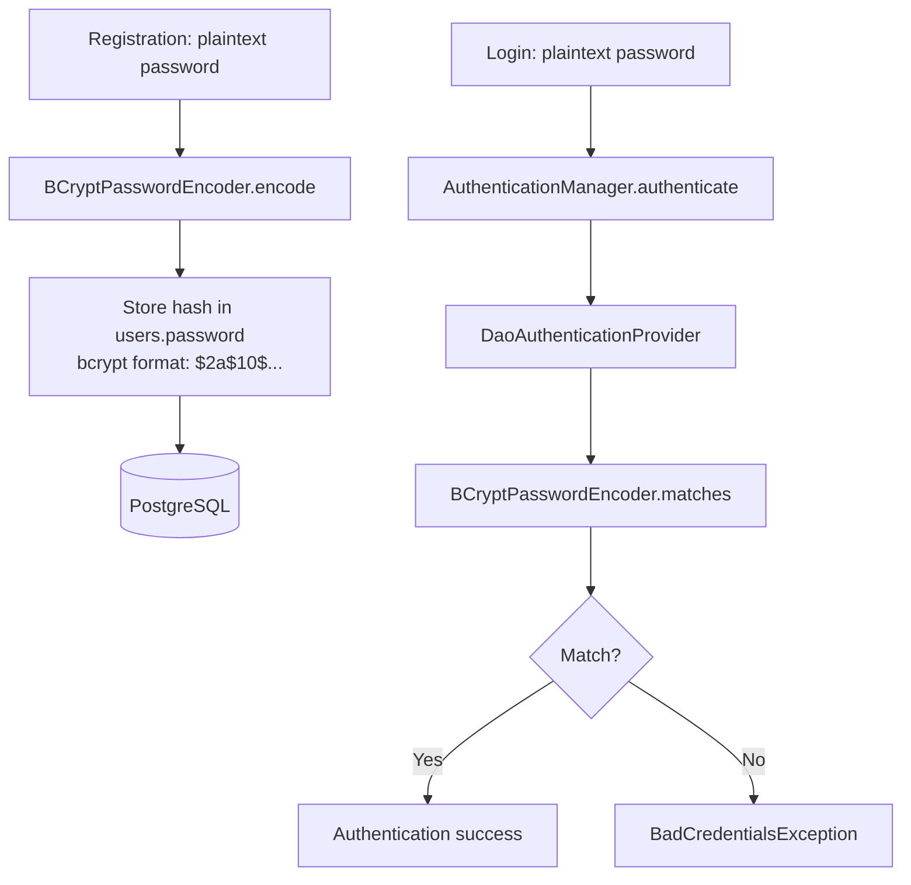

### JWT Token Security

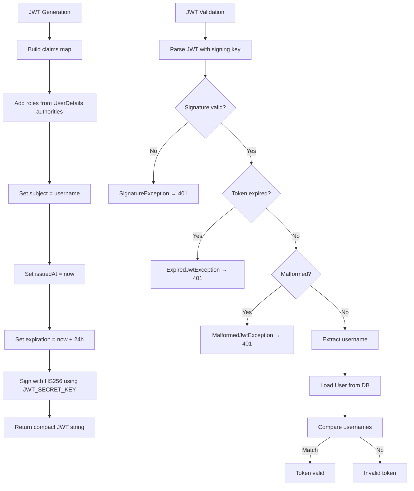

### GitHub Token Encryption

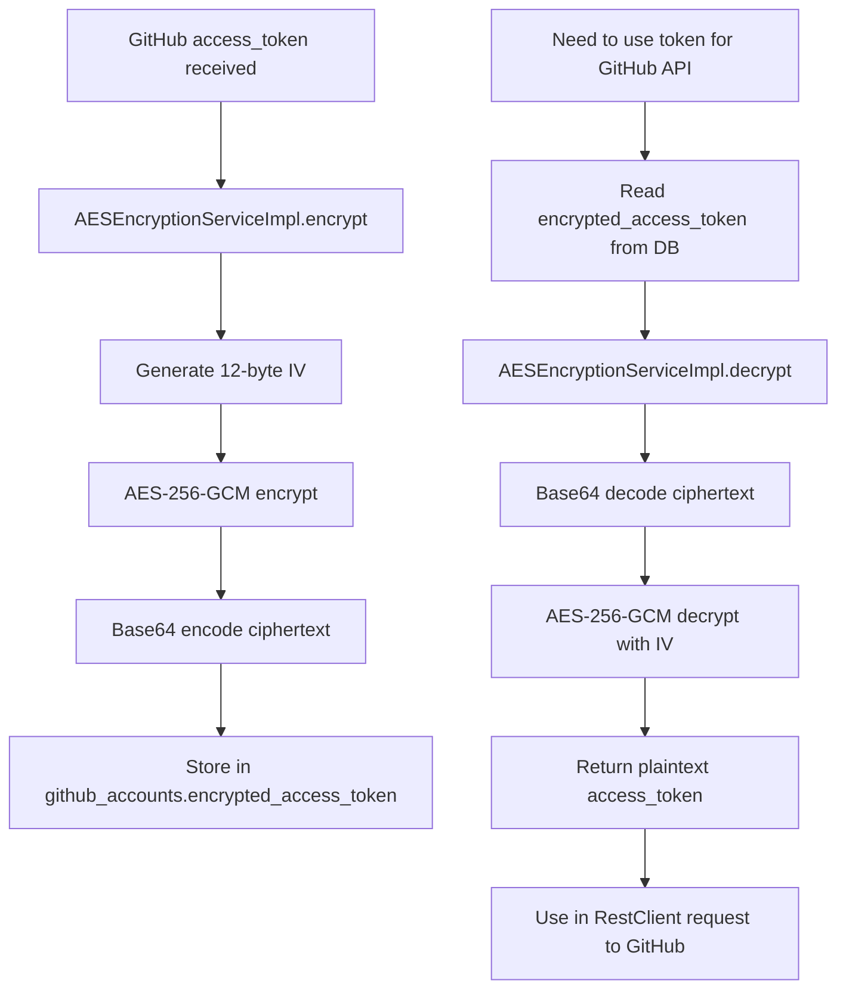

### CORS & CSRF Configuration

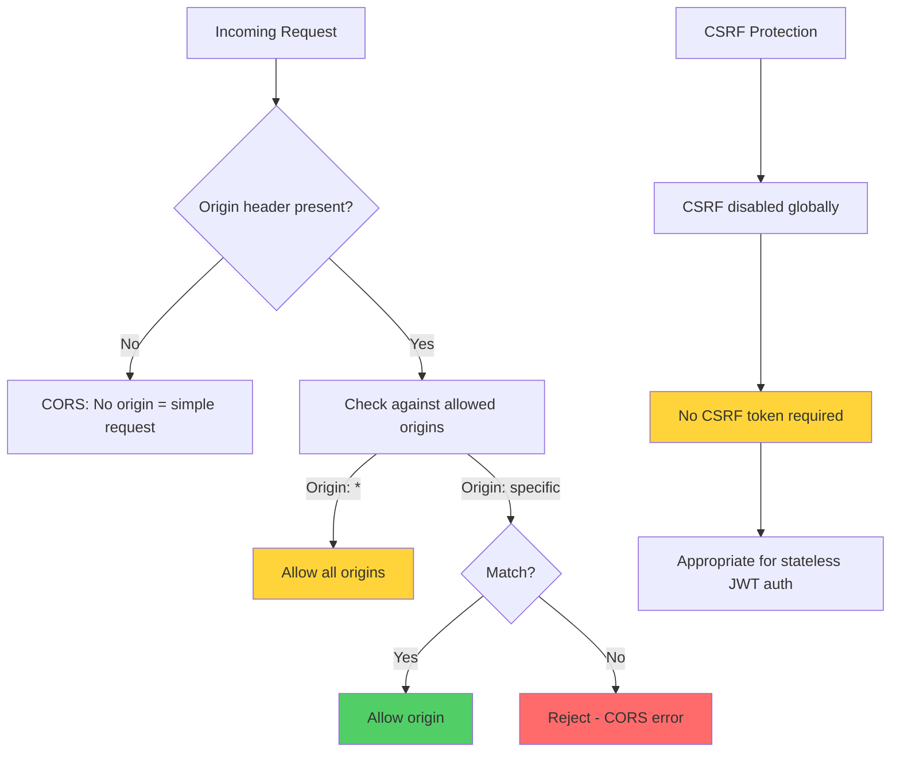

## Configuration Architecture

| Mechanism                  | Where Used                                                                                                          | Example                                                                   |
|----------------------------|---------------------------------------------------------------------------------------------------------------------|---------------------------------------------------------------------------|
| `@Configuration` + `@Bean` | `AppConfiguration`, `CORSConfiguration`, `OpenAPIConfiguration`, `RestClientConfiguration`, `SecurityConfiguration` | `RestClient` bean, `SecurityFilterChain` bean                             |
| `@ConfigurationProperties` | `configs/properties/` classes                                                                                       | `GithubProperties` (`github.oauth.*`), `JWTProperties` (`security.jwt.*`) |
| `@Value`                   | Direct injection in services                                                                                        | `EmailServiceImpl` reads `spring.mail.username`                           |
| Environment variables      | `.env` file via `spring-dotenv`                                                                                     | `SPRING_DATASOURCE_URL`, `JWT_SECRET_KEY`                                 |
| `application.yml`          | Primary config file                                                                                                 | Server port, datasource, flyway, mail, security                           |

**Configuration loading flow:**

```mermaid
flowchart LR
    A[application.yml] --> B[Spring Environment]
    C[.env file] --> B
    D[OS Environment Variables] --> B
    B --> E[@Value injection]
    B --> F[@ConfigurationProperties]
    E --> G[Beans / Services]
    F --> G
    G --> H[Runtime Configuration]
```

## Design Patterns

| Pattern                     | Where Used            | Implementation                                                        |
|-----------------------------|-----------------------|-----------------------------------------------------------------------|
| **Dependency Injection**    | Throughout            | Constructor injection (explicit or Lombok `@RequiredArgsConstructor`) |
| **Repository Pattern**      | Data access           | `UserRepository`, `RoleRepository`, `GitHubAccountRepository`         |
| **Service Layer Pattern**   | Business logic        | Interface + implementation for every capability                       |
| **DTO Pattern**             | API contracts         | Request/response DTOs separate from entities                          |
| **Builder Pattern**         | Response construction | Lombok `@Builder` on `Response`, `ErrorResponse`, all data DTOs       |
| **Chain of Responsibility** | Filter chain          | `RequestLoggingFilter` → Spring Security → `AuthenticationFilter`     |
| **Singleton**               | Bean scope            | Default for all `@Service`/`@Component`/`@Configuration`              |

## SOLID Principles

| Principle                 | Status           | Evidence                                                                             |
|---------------------------|------------------|--------------------------------------------------------------------------------------|
| **Single Responsibility** | Mostly respected | `AdminController` returning `Role` entity directly is the one exception              |
| **Open/Closed**           | Respected        | New exceptions plug into `GlobalExceptionHandler` without touching existing handlers |
| **Liskov Substitution**   | No violations    | Each service interface has exactly one implementation                                |
| **Interface Segregation** | Respected        | Service interfaces are narrow (`EmailService` has a single method)                   |
| **Dependency Inversion**  | Mostly respected | One gap: `GithubAuthServiceImpl` depends on concrete `GithubStateManager`            |

## Technology Stack

| Layer       | Technology                      | Version      |
|-------------|---------------------------------|--------------|
| Language    | Java                            | 17           |
| Framework   | Spring Boot                     | 3.2.0        |
| Security    | Spring Security                 | (via parent) |
| Data        | Spring Data JPA / Hibernate     | (via parent) |
| Database    | PostgreSQL                      | 15+          |
| Migrations  | Flyway Core + Flyway PostgreSQL | 10.1.0       |
| Auth        | JJWT (io.jsonwebtoken)          | 0.11.5       |
| API Docs    | springdoc-openapi               | 2.2.0        |
| Mail        | Spring Mail + Thymeleaf         | (via parent) |
| HTTP Client | Spring RestClient               | (via parent) |
| Env Mgmt    | spring-dotenv                   | 4.0.0        |
| Build       | Maven                           | 3.9+         |
| Boilerplate | Lombok                          | 1.18.30      |

**Present in `pom.xml` but unused in source:**

- `spring-kafka` — no producer/consumer/listener anywhere
- `spring-boot-starter-oauth2-client` — GitHub integration is a hand-rolled REST flow

## Database Schema Overview

```mermaid
erDiagram
    users ||--o{ user_roles : "has many"
    users ||--o| github_accounts : "has one"
    roles ||--o{ user_roles : "assigned to"
    qubes ||--o{ qube_members : "contains"
    qubes ||--o| qube_metrics : "has one"
    users ||--o{ qube_members : "is member of"
    users ||--o{ qube_members : "invited by"

    users {
        uuid id PK "gen_random_uuid()"
        varchar username UK "NOT NULL"
        varchar email UK "NOT NULL"
        varchar password "NOT NULL"
        varchar verification_code
        timestamp verification_expires_at
        boolean enabled "DEFAULT FALSE"
        boolean account_locked "DEFAULT FALSE"
        instant locked_until
        instant last_login_at
        integer failed_login_attempts "DEFAULT 0"
        timestamp created_at "DEFAULT CURRENT_TIMESTAMP"
        timestamp updated_at
        uuid created_by
        uuid updated_by
        timestamp deleted_at
        uuid deleted_by
        boolean is_deleted "DEFAULT FALSE"
    }

    roles {
        uuid id PK "gen_random_uuid()"
        varchar name UK "NOT NULL"
        varchar description "NOT NULL"
        timestamp created_at "DEFAULT CURRENT_TIMESTAMP"
        timestamp updated_at
        uuid created_by
        uuid updated_by
        timestamp deleted_at
        uuid deleted_by
        boolean is_deleted "DEFAULT FALSE"
    }

    user_roles {
        uuid user_id PK,FK "→ users.id"
        uuid role_id PK,FK "→ roles.id"
    }

    github_accounts {
        uuid id PK "gen_random_uuid()"
        uuid user_id UK,FK "→ users.id"
        bigint github_id UK "NOT NULL"
        varchar username "NOT NULL"
        varchar name
        varchar email
        varchar avatar_url
        varchar profile_url
        varchar bio
        varchar company
        varchar blog
        varchar location
        integer public_repos
        integer followers
        integer following
        varchar encrypted_access_token "NOT NULL"
        varchar encrypted_refresh_token
        varchar token_type
        varchar scope
        timestamp access_token_expires_at
        timestamp refresh_token_expires_at
        timestamp last_synced_at
        timestamp created_at "DEFAULT CURRENT_TIMESTAMP"
        timestamp updated_at
        uuid created_by FK "→ users.id"
        uuid updated_by FK "→ users.id"
        timestamp deleted_at
        uuid deleted_by FK "→ users.id"
        boolean is_deleted "DEFAULT FALSE"
    }

    qubes {
        uuid id PK "gen_random_uuid()"
        varchar name "NOT NULL"
        varchar slug UK "NOT NULL"
        text description
        bigint github_repository_id "NOT NULL"
        varchar github_node_id
        varchar repository_owner "NOT NULL"
        varchar repository_name "NOT NULL"
        varchar repository_full_name "NOT NULL"
        varchar default_branch "NOT NULL"
        varchar target_branch "NOT NULL"
        varchar clone_url "NOT NULL"
        varchar html_url "NOT NULL"
        boolean private_repository "NOT NULL"
        varchar workspace_path "NOT NULL"
        boolean webhook_enabled "DEFAULT TRUE"
        boolean auto_scan_enabled "DEFAULT FALSE"
        boolean ai_remediation_enabled "DEFAULT FALSE"
        boolean archived "DEFAULT FALSE"
        timestamp created_at "DEFAULT CURRENT_TIMESTAMP"
        timestamp updated_at
        uuid created_by FK "→ users.id"
        uuid updated_by FK "→ users.id"
        timestamp deleted_at
        uuid deleted_by FK "→ users.id"
        boolean is_deleted "DEFAULT FALSE"
    }

    qube_members {
        uuid id PK "gen_random_uuid()"
        uuid qube_id FK "→ qubes.id"
        uuid user_id FK "→ users.id"
        varchar role "NOT NULL"
        boolean invitation_accepted "DEFAULT FALSE"
        boolean active "DEFAULT TRUE"
        timestamp invited_at
        timestamp joined_at
        uuid invited_by FK "→ users.id"
        timestamp created_at "DEFAULT CURRENT_TIMESTAMP"
        timestamp updated_at
        uuid created_by FK "→ users.id"
        uuid updated_by FK "→ users.id"
        timestamp deleted_at
        uuid deleted_by FK "→ users.id"
        boolean is_deleted "DEFAULT FALSE"
        uk_qube_member UNIQUE(qube_id, user_id)
    }

    qube_metrics {
        uuid id PK "gen_random_uuid()"
        uuid qube_id UK,FK "→ qubes.id"
        uuid latest_scan_id
        bigint total_scans "DEFAULT 0"
        bigint successful_scans "DEFAULT 0"
        bigint failed_scans "DEFAULT 0"
        bigint cancelled_scans "DEFAULT 0"
        bigint queued_scans "DEFAULT 0"
        bigint total_findings "DEFAULT 0"
        bigint open_findings "DEFAULT 0"
        bigint resolved_findings "DEFAULT 0"
        bigint suppressed_findings "DEFAULT 0"
        bigint critical_findings "DEFAULT 0"
        bigint high_findings "DEFAULT 0"
        bigint medium_findings "DEFAULT 0"
        bigint low_findings "DEFAULT 0"
        bigint info_findings "DEFAULT 0"
        bigint ai_remediations_generated "DEFAULT 0"
        bigint pull_requests_created "DEFAULT 0"
        bigint merged_pull_requests "DEFAULT 0"
        bigint average_scan_duration_ms "DEFAULT 0"
        bigint fastest_scan_duration_ms "DEFAULT 0"
        bigint slowest_scan_duration_ms "DEFAULT 0"
        double precision security_score "DEFAULT 100"
        double precision risk_score "DEFAULT 0"
        timestamp created_at "DEFAULT CURRENT_TIMESTAMP"
        timestamp updated_at
        uuid created_by FK "→ users.id"
        uuid updated_by FK "→ users.id"
        timestamp deleted_at
        uuid deleted_by FK "→ users.id"
        boolean is_deleted "DEFAULT FALSE"
    }
```

## Future Scalability

| Concern             | Current State                            | Planned / Notes                                          |
|---------------------|------------------------------------------|----------------------------------------------------------|
| Containerization    | No Dockerfile (placeholder only)         | Stateless JAR is straightforward to containerize         |
| Kubernetes          | Not configured                           | Feasible once containerized                              |
| Microservices       | Single Maven module                      | Interface/impl split is a reasonable seam for extraction |
| Kafka               | Dependency declared, zero implementation | Aspirational                                             |
| Redis               | No dependency                            | Referenced in banner.txt only                            |
| Rate Limiting       | `limiter/` package is empty              | Aspirational architecture in `RATE_LIMITER_POLICIES.md`  |
| AI-powered analysis | Not present                              | Banner text only, no code                                |

## Architecture Decisions

1. **JWT over server-side sessions** — keeps the API stateless and horizontally scalable.
2. **Signed, purpose-tagged JWT as GitHub OAuth `state`** — closes a specific CSRF/account-hijack gap (documented in
   source).
3. **HTTP-verb-based authorization** — reduces the number of path rules as new endpoints are added, layered with
   explicit path exceptions and method-level `@PreAuthorize` for finer control.
4. **Interface/impl separation everywhere** — enables testing via mocks and future extraction of bounded contexts.
5. **Flyway for migrations** — ensures schema consistency across environments; Hibernate validates only (
   `ddl-auto: validate`).
6. **AES-256-GCM for GitHub tokens** — tokens are never stored in plaintext; encryption is handled at the service layer.

## Code Organization

Package naming is consistent and descriptive; sub-packaging by feature within technical layers (`services/auth`,
`services/github`) is a reasonable hybrid. Class sizes are small and single-purpose.

**Verified dead-code items:**

1. `EmailProperties` — declared with `@ConfigurationProperties(prefix = "mail")` but never injected; `EmailServiceImpl`
   reads via `@Value("${spring.mail.username}")` instead.
2. `net.jqube.server.exceptions.MethodArgumentNotValidException` — a custom exception class that is never thrown;
   `GlobalExceptionHandler` actually imports Spring's `org.springframework.web.bind.MethodArgumentNotValidException`.

**Verified inconsistency:**

1. `GithubStateManager` — has no interface, while `GithubAuthServiceImpl` depends on it directly. Every other service
   follows the interface/impl pattern.

## Strengths

- Consistent `Response<T>` / `ErrorResponse` envelope across almost every endpoint.
- Centralized exception handling covering a wide range of specific failure modes, including JWT-library exceptions.
- A genuinely thoughtful, documented security fix for the GitHub OAuth state parameter.
- Clear interface/implementation separation for nearly every service.
- Idiomatic, minimal use of Lombok without obscuring business logic.
- Comprehensive audit fields (`created_at`, `updated_at`, `deleted_at`, `created_by`, etc.) on all entities.

## Possible Improvements

| Area                | Current State                                        | Suggested Improvement                                       |
|---------------------|------------------------------------------------------|-------------------------------------------------------------|
| Entity→DTO mapping  | Hand-written per service                             | Introduce MapStruct or dedicated mapper classes             |
| State service       | No interface                                         | Add `GithubStateService` interface                          |
| Filter registration | Auto-registered by Spring Boot                       | Explicitly register in `SecurityConfiguration`              |
| Dead code           | `EmailProperties`, `MethodArgumentNotValidException` | Remove or rename                                            |
| JWT refresh         | No refresh token support                             | Add refresh token mechanism                                 |
| Rate limiting       | None                                                 | Add on `/auth/login`, `/auth/register`, `/auth/resend-code` |
| CORS                | Wide-open (`*`)                                      | Activate stricter config with specific origins              |
| Caching             | None                                                 | Add for infrequently-changing reads like `getAllRoles()`    |
| `@Transactional`    | On `login()` (read-only)                             | Confirm intent or remove                                    |
| Qube domain         | Schema only (V6-V8)                                  | Add controllers, repositories, services                     |

## Development Guidelines

- New business capabilities should be added as a service interface (`services/...`) plus an implementation (
  `services/impls/...`).
- New response payloads should go in `responses/dataDTOs` (or `dtos/auth` for user-facing DTOs) and never expose JPA
  entities directly through a controller.
- New exceptions should extend `RuntimeException`, live in `exceptions/`, and get a corresponding `@ExceptionHandler` in
  `GlobalExceptionHandler`.
- New configuration values should be added to `application.yml` with an environment-variable placeholder and, where more
  than one or two values are involved, a corresponding `@ConfigurationProperties` class under `configs/properties`.
- Role checks should continue to use `RoleName` + `@PreAuthorize`/`authorizeHttpRequests`, not hardcoded string literals
  scattered through business logic.
