# JQUBE Server — Security Documentation

## Table of Contents

1. [Overview](#overview)
2. [Security Architecture](#security-architecture)
3. [Authentication Flow](#authentication-flow)
4. [Authorization Model](#authorization-model)
5. [JWT Security](#jwt-security)
6. [Password Storage](#password-storage)
7. [GitHub OAuth State Protection](#github-oauth-state-protection)
8. [Token Encryption](#token-encryption)
9. [CORS Configuration](#cors-configuration)
10. [CSRF Protection](#csrf-protection)
11. [Session Management](#session-management)
12. [Email Verification Security](#email-verification-security)
13. [Account Lockout](#account-lockout)
14. [Security Headers](#security-headers)
15. [Threat Mitigations](#threat-mitigations)
16. [Security Checklist](#security-checklist)

---

## Overview

JQUBE Server implements a defense-in-depth security model covering authentication, authorization, data protection, and transport security. The security layer is built on Spring Security with custom JWT handling, AES-256-GCM encryption for sensitive tokens, and a hand-rolled but security-hardened GitHub OAuth2 flow.

### Security Principles

- **Stateless by design** — No server-side sessions; every request is self-contained.
- **Least privilege** — Role-based access control with granular permissions.
- **Defense in depth** — Multiple layers of validation (path rules, verb rules, method-level annotations).
- **Secure defaults** — CORS disabled by default, CSRF disabled for stateless API, strict password encoding.

---

## Security Architecture

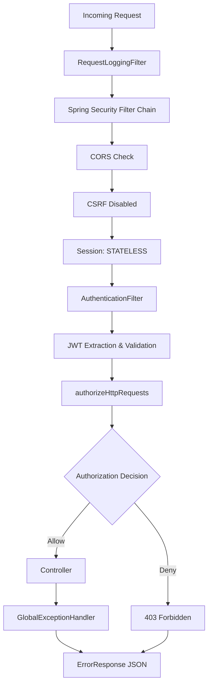

### Security Layers

```mermaid
flowchart LR
    subgraph "Layer 1: Transport"
        T1[HTTPS/TLS]
        T2[CORS Policy]
    end

    subgraph "Layer 2: Authentication"
        A1[JWT Token]
        A2[Bearer Header]
        A3[Token Validation]
    end

    subgraph "Layer 3: Authorization"
        Z1[Path Rules]
        Z2[Verb Rules]
        Z3[@PreAuthorize]
    end

    subgraph "Layer 4: Input Validation"
        I1[@Valid Annotations]
        I2[Bean Validation]
        I3[Type Safety]
    end

    subgraph "Layer 5: Data Protection"
        D1[AES-256-GCM]
        D2[BCrypt Passwords]
        D3[Soft Deletes]
    end

    T1 --> A1
    T2 --> A1
    A1 --> Z1
    A2 --> Z1
    A3 --> Z1
    Z1 --> Z3
    Z2 --> Z3
    Z3 --> I1
    I1 --> I3
    I2 --> I3
    I3 --> D1
    D1 --> D3
    D2 --> D3
```

---

## Authentication Flow

### Complete Authentication Sequence

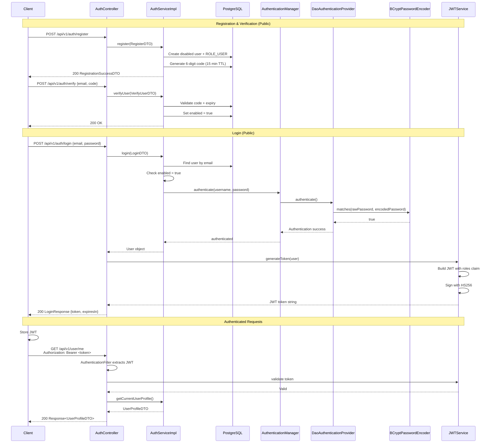

---

## Authorization Model

### Multi-Layer Authorization

```mermaid
flowchart TD
    A[HTTP Request] --> B{Public Path?}
    B -->|Yes| C[Permit All]
    B -->|No| D{Has JWT?}
    D -->|No| E[401 Unauthorized]
    D -->|Yes| F{Token Valid?}
    F -->|No| E
    F -->|Yes| G{HTTP Method Check}

    G -->|GET| H{Has ADMIN, USER, or VIEWER?}
    G -->|POST| I{Has ADMIN or USER?}
    G -->|PUT| I
    G -->|PATCH| J{Has ADMIN?}
    G -->|DELETE| J

    H -->|Yes| K{@PreAuthorize Check}
    H -->|No| E
    I -->|Yes| K
    I -->|No| E
    J -->|Yes| K
    J -->|No| E

    K -->|Pass| L[Execute Controller]
    K -->|Fail| E

    C --> M[Response]
    L --> M

    style E fill:#ff6b6b
    style C fill:#51cf66
    style L fill:#51cf66
```

### Authorization Configuration

```mermaid
flowchart TD
    A[SecurityConfiguration] --> B[authorizeHttpRequests]
    B --> C[requestMatchers PUBLIC]
    C --> C1["/api/v1/auth/**"]
    C --> C2["/health"]
    C --> C3["/v3/api-docs/**"]
    C --> C4["/swagger-ui/**"]
    C --> C5["GET /api/v1/github/callback"]

    B --> D[requestMatchers by HTTP Method]
    D --> D1["GET → ADMIN, USER, VIEWER"]
    D --> D2["POST → ADMIN, USER"]
    D --> D3["PUT → ADMIN, USER"]
    D --> D4["PATCH → ADMIN"]
    D --> D5["DELETE → ADMIN"]

    B --> E[anyRequest]
    E --> E1[authenticated]

    F[Method-Level] --> G[@PreAuthorize]
    G --> G1["AdminController → hasRole('ADMIN')"]
    G --> G2["UserController.me → hasAnyRole('ADMIN','USER','VIEWER')"]
    G --> G3["GithubController → hasRole('USER')"]
```

---

## JWT Security

### JWT Structure & Claims

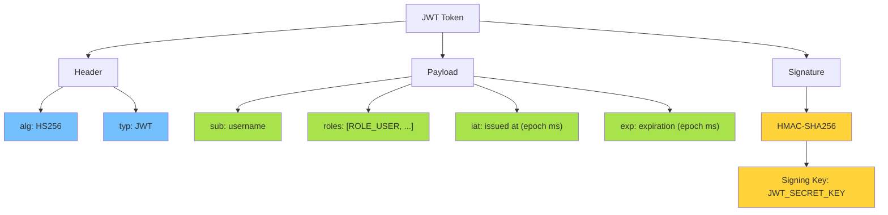

### JWT Generation & Validation Flow

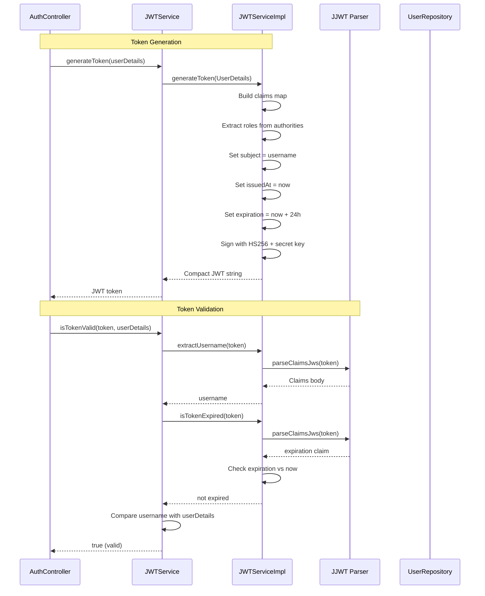

### Token Expiration & Renewal

```mermaid
flowchart TD
    A[JWT Issued] --> B[exp = now + 86400000ms (24h)]
    B --> C[Token valid for 24 hours]
    C --> D{Request with expired token?}
    D -->|No| E[Token valid → proceed]
    D -->|Yes| F[ExpiredJwtException thrown]
    F --> G[GlobalExceptionHandler catches]
    G --> H[401 Unauthorized returned]
    E --> I[User must re-login]

    style H fill:#ff6b6b
    style E fill:#51cf66
```

---

## Password Storage

### BCrypt Hashing Flow

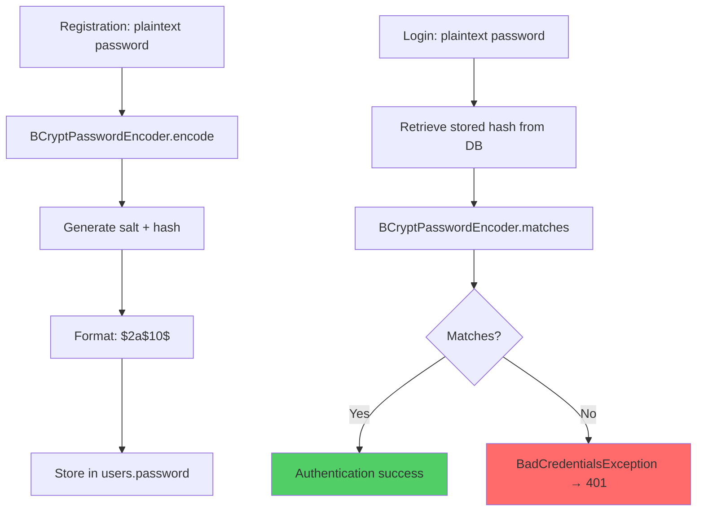

### Password Strength Requirements

| Requirement | Implementation | Location |
|---|---|---|
| Minimum length | Jakarta Validation `@Size(min = 8)` | `RegisterDTO` |
| Complexity | Not enforced server-side | — |
| Hashing algorithm | BCrypt (Spring Security default) | `SecurityConfiguration` |
| Salt | Automatic per-password salt | BCrypt internals |
| Work factor | Default (10 rounds) | Spring Security default |

---

## GitHub OAuth State Protection

### State JWT Mechanism

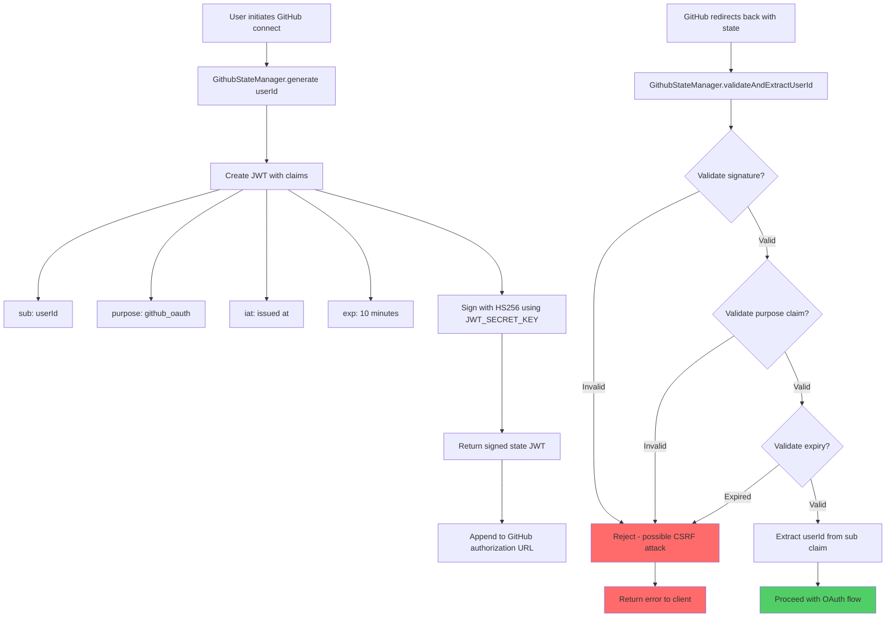

### Why This Matters

Without this protection, a raw user ID or random string as OAuth `state` is vulnerable to:

1. **CSRF attacks** — Attacker tricks user into authorizing with attacker's state
2. **Account hijacking** — Attacker reuses a captured state value
3. **Session fixation** — State value reused across sessions

The signed JWT approach ensures:
- **Authenticity** — Only the server can create valid states
- **Integrity** — State cannot be tampered with
- **Time-bound** — States expire after 10 minutes
- **Purpose-bound** — State can only be used for GitHub OAuth

---

## Token Encryption

### AES-256-GCM Encryption Flow

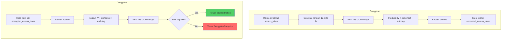

### Encryption Properties

| Property | Value | Source |
|---|---|---|
| Algorithm | AES-256-GCM | `AESEncryptionServiceImpl` |
| Key Size | 256 bits | `security.encryption.key` env var |
| IV Size | 12 bytes | Random per encryption |
| Auth Tag | 128 bits | GCM default |
| Key Source | Environment variable | `AES_ENCRYPTION_KEY` |

---

## CORS Configuration

### Current Configuration

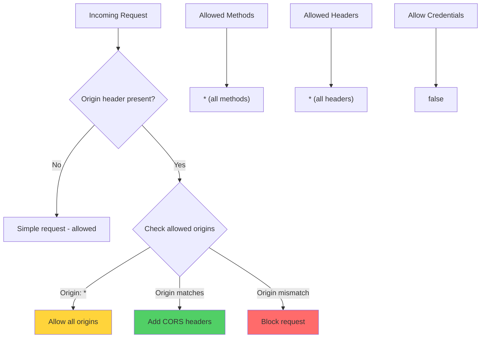

### CORS Headers Applied

| Header | Value | Purpose |
|---|---|---|
| `Access-Control-Allow-Origin` | `*` | Allows any origin |
| `Access-Control-Allow-Methods` | `*` | Allows any HTTP method |
| `Access-Control-Allow-Headers` | `*` | Allows any header |
| `Access-Control-Allow-Credentials` | `false` | Cookies not sent cross-origin |

### Recommended Production Configuration

```yaml
cors:
  allowed-origins:
    - https://jqube-app.com
    - https://admin.jqube-app.com
  allowed-methods:
    - GET
    - POST
    - PUT
    - DELETE
    - OPTIONS
  allowed-headers:
    - Authorization
    - Content-Type
    - X-Requested-With
  allow-credentials: true
  max-age: 3600
```

---

## CSRF Protection

### CSRF Status

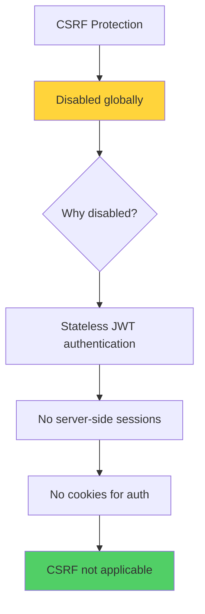

### Why CSRF is Disabled

| Factor | Explanation |
|---|---|
| Authentication method | Bearer token in `Authorization` header |
| Session policy | `STATELESS` — no server-side sessions |
| Cookies | Not used for authentication |
| CSRF attack vector | Not applicable — attacker cannot read/write custom headers |

**Note:** If cookie-based authentication is ever added, CSRF protection must be re-enabled.

---

## Session Management

### Session Configuration

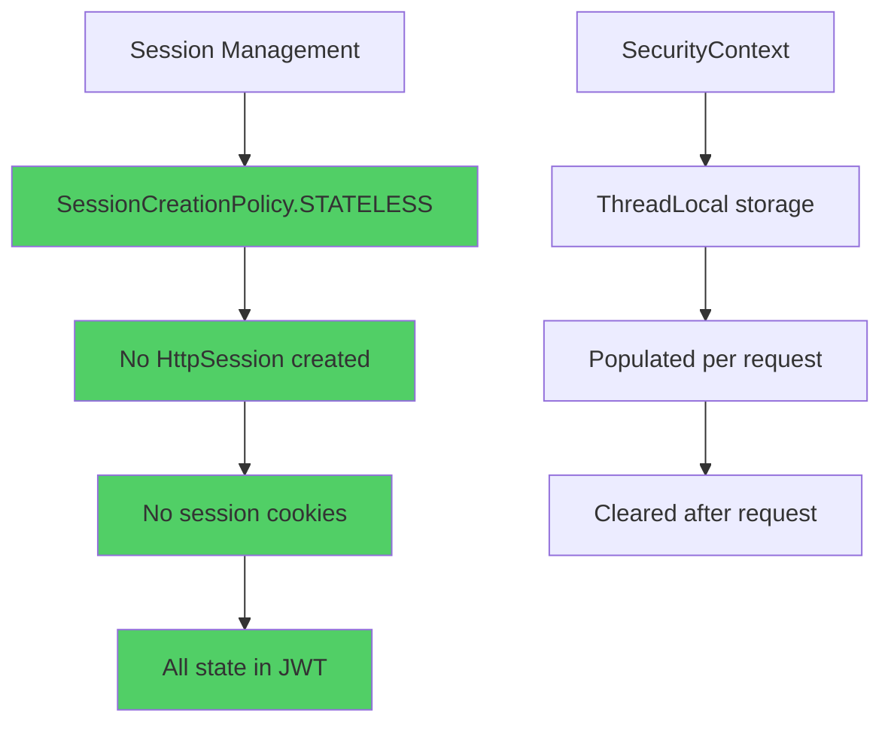

### Session Security Properties

| Property | Value | Impact |
|---|---|---|
| `sessionCreationPolicy` | `STATELESS` | No sessions created |
| `sessionFixation` | N/A | Not applicable |
| `maximumSessions` | N/A | Not applicable |
| `sessionCookie` | Not sent | No JSESSIONID cookie |

---

## Email Verification Security

### Verification Code Flow

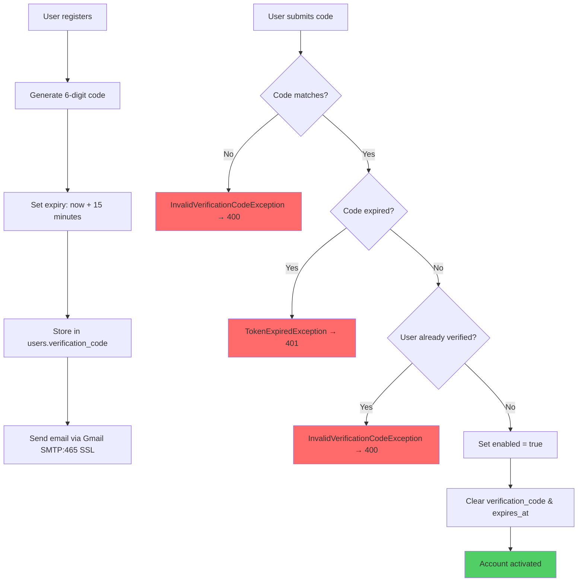

### Verification Security Properties

| Property | Value | Purpose |
|---|---|---|
| Code format | 6-digit numeric | Easy to type, hard to brute-force |
| Code TTL | 15 minutes | Limits window for brute-force |
| Storage | Plaintext in DB | Not a secret — single-use, time-limited |
| Resend limit | None enforced | Can request new code anytime |
| Email transport | Gmail SMTP:465 SSL | Encrypted in transit |

---

## Account Lockout

### Failed Login Tracking

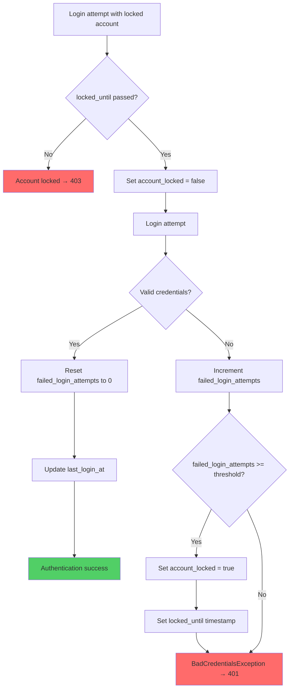

### Lockout Configuration

| Field | Type | Purpose |
|---|---|---|
| `account_locked` | BOOLEAN | Lock status flag |
| `locked_until` | INSTANT | Lock expiry timestamp |
| `failed_login_attempts` | INTEGER | Consecutive failure counter |
| `last_login_at` | INSTANT | Last successful login |

---

## Security Headers

### Current Headers

The application does not explicitly set security headers (no `SecurityFilterChain` header configuration). Spring Boot's default behavior applies:

| Header | Default Value | Recommendation |
|---|---|---|
| `X-Content-Type-Options` | Not set | Add `nosniff` |
| `X-Frame-Options` | Not set | Add `DENY` |
| `X-XSS-Protection` | Not set | Add `1; mode=block` |
| `Strict-Transport-Security` | Not set | Add `max-age=31536000; includeSubDomains` |
| `Content-Security-Policy` | Not set | Configure based on needs |

### Recommended Header Configuration

```java
http.headers(headers -> headers
    .contentSecurityPolicy("default-src 'self'; frame-ancestors 'none';")
    .xssProtection(Customizer.withDefaults())
    .contentTypeOptions(Customizer.withDefaults())
    .httpStrictTransportSecurity(hsts -> hsts
        .includeSubdomains(true)
        .maxAgeInSeconds(31536000)
    )
    .frameOptions(Customizer.withDefaults())
);
```

---

## Threat Mitigations

### Mitigated Threats

| Threat | Mitigation | Implementation |
|---|---|---|
| **Credential stuffing** | BCrypt hashing + email verification | `BCryptPasswordEncoder`, `verification_code` |
| **Brute-force login** | Account lockout tracking | `failed_login_attempts`, `account_locked` |
| **JWT theft** | Short expiry (24h), HTTPS only | `expiration-time: 86400000` |
| **CSRF (GitHub OAuth)** | Signed state JWT | `GithubStateManager` |
| **Token replay** | Stateless + short expiry | No session storage |
| **GitHub token exposure** | AES-256-GCM encryption | `AESEncryptionServiceImpl` |
| **Email enumeration** | Generic error messages | Consistent `ErrorResponse` |
| **Mass assignment** | DTO pattern, no entity exposure | Separate request/response DTOs |
| **Injection attacks** | JPA parameterized queries | Spring Data JPA |
| **Man-in-the-middle** | TLS/HTTPS, SMTP SSL | Production HTTPS, Gmail SSL |

### Unmitigated Risks

| Risk | Current State | Recommendation |
|---|---|---|
| **Rate limiting** | None | Add on `/auth/*` endpoints |
| **Brute-force verification codes** | No rate limit | Add per-IP rate limiting |
| **CORS exposure** | Wide-open (`*`) | Restrict to known origins |
| **Security headers** | Minimal | Add HSTS, CSP, etc. |
| **Refresh tokens** | None for app JWT | Add refresh token mechanism |
| **IP blocking** | None | Add after repeated failures |

---

## Security Checklist

### Pre-Deployment Checklist

- [ ] `JWT_SECRET_KEY` is a strong, random 256-bit base64-encoded key
- [ ] `AES_ENCRYPTION_KEY` is a strong, random 256-bit base64-encoded key
- [ ] `SPRING_DATASOURCE_PASSWORD` is strong and unique
- [ ] `GITHUB_OAUTH_CLIENT_SECRET` is stored securely (not in code)
- [ ] `APP_PASSWORD` (Gmail app password) is stored securely
- [ ] HTTPS is enforced in production (reverse proxy / load balancer)
- [ ] CORS origins are restricted to known domains
- [ ] Security headers are configured (HSTS, CSP, etc.)
- [ ] Rate limiting is enabled on authentication endpoints
- [ ] Database connections use SSL/TLS
- [ ] Flyway migrations are run in CI/CD, not at runtime
- [ ] Logs do not contain sensitive data (tokens, passwords)
- [ ] `.env` file is excluded from version control
- [ ] Regular security audits of dependencies (`mvn dependency:tree`)

### Ongoing Security Practices

- Rotate `JWT_SECRET_KEY` periodically (requires user re-authentication)
- Monitor failed login attempts for brute-force detection
- Review and update CORS policies as frontend domains change
- Keep dependencies updated (`mvn versions:display-dependency-updates`)
- Audit GitHub OAuth scopes — request minimum required
- Monitor `qube_metrics` for unusual scan patterns
