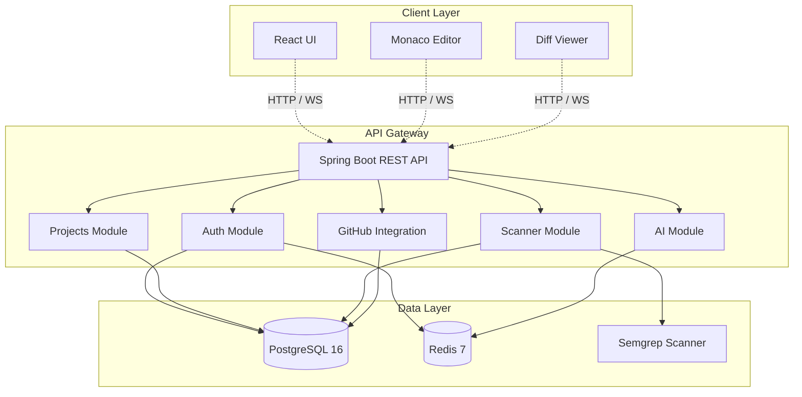
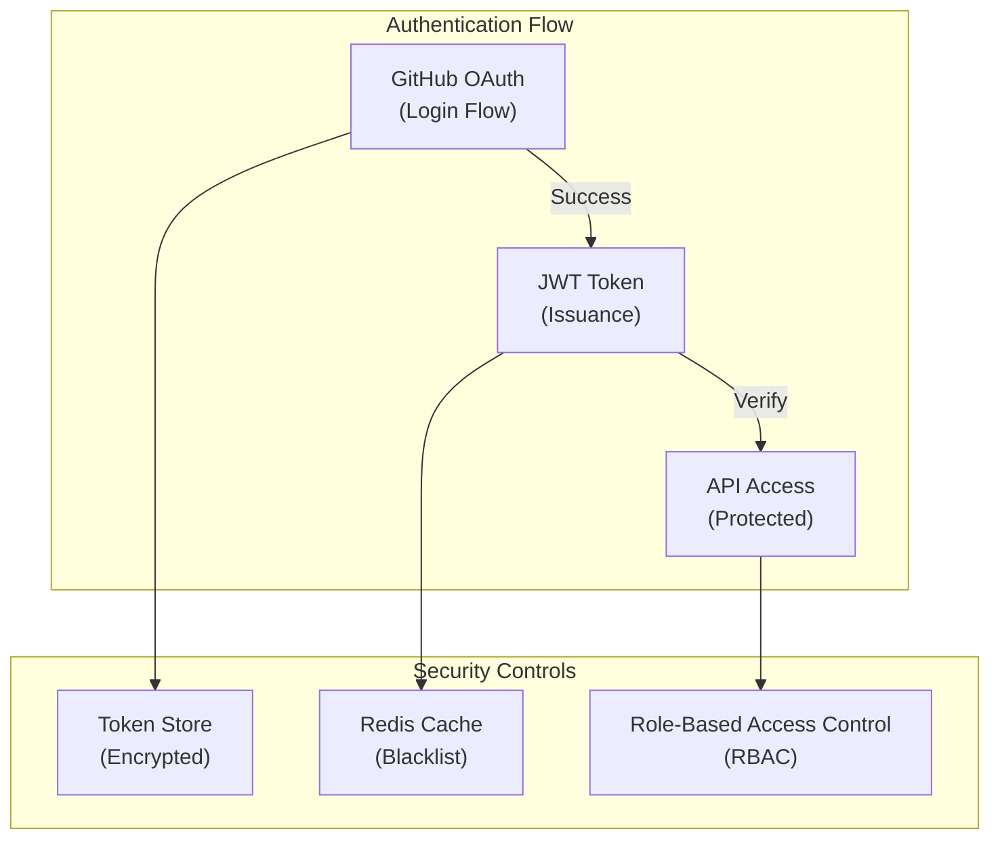

# Architecture

JQube follows a **layered microservices architecture** with clear separation of concerns between the frontend, backend, and data layers.

## System Overview

## Component Breakdown

### Frontend (React)

The frontend is a single-page application built with React 18 and TypeScript:

| Component | Technology | Purpose |
|---|---|---|
| **UI Framework** | React 18 | Component-based UI |
| **State Management** | Zustand | Lightweight global state |
| **Styling** | Tailwind CSS | Utility-first CSS |
| **Code Editor** | Monaco Editor | In-browser code editing |
| **Routing** | React Router v6 | Client-side navigation |
| **HTTP Client** | Axios | API communication |
| **Auth** | GitHub OAuth | User authentication |

### Backend (Spring Boot)

The backend is a Java 21 application built with Spring Boot 3:

| Module | Responsibility |
|---|---|
| **AuthController** | GitHub OAuth flow, JWT issuance |
| **ProjectController** | CRUD operations for projects |
| **RepositoryController** | GitHub repository management |
| **ScanController** | Trigger and manage security scans |
| **FindingController** | Vulnerability findings CRUD |
| **RemediationController** | AI fix generation and management |
| **PullRequestController** | GitHub PR creation and tracking |

### Data Layer

| Service | Purpose | Configuration |
|---|---|---|
| **PostgreSQL 16** | Primary data store | Tables for users, projects, repos, findings |
| **Redis 7** | Caching and sessions | JWT blacklist, scan status cache |
| **Semgrep** | Security scanner | CLI-based static analysis |

## Request Flow

Here is what happens when a user triggers a security scan:

1. **User** clicks "Scan" in the UI
2. **Frontend** sends `POST /api/scans` with the repository ID
3. **Backend** validates the JWT token and user permissions
4. **ScanService** clones the repository from GitHub
5. **Semgrep** runs analysis with auto-config rules
6. **ResultParser** processes JSON output into Finding entities
7. **Database** stores all findings with metadata
8. **Redis** caches the scan status for real-time updates
9. **WebSocket** pushes scan progress to the frontend
10. **UI** displays findings organized by severity

## Security Architecture

- **Authentication**: GitHub OAuth 2.0 with PKCE
- **Authorization**: JWT-based with role claims
- **Token Storage**: Encrypted at rest, short-lived access tokens
- **Session Management**: Redis-backed with automatic expiry
- **CORS**: Configured for specific origins only
- **Rate Limiting**: API-level throttling to prevent abuse

## Design Principles

JQube's architecture follows these principles:

1. **Separation of Concerns** — Each layer has a single responsibility
2. **Stateless Backend** — JWT-based auth enables horizontal scaling
3. **Event-Driven Updates** — WebSocket for real-time scan progress
4. **Fail-Safe Defaults** — Security settings default to the most restrictive
5. **Immutable Infrastructure** — Docker containers ensure consistency

<Callout type="info">
For more detail on each layer, see [Frontend](/docs/frontend), [Backend](/docs/backend), and [Database](/docs/database).
</Callout>
