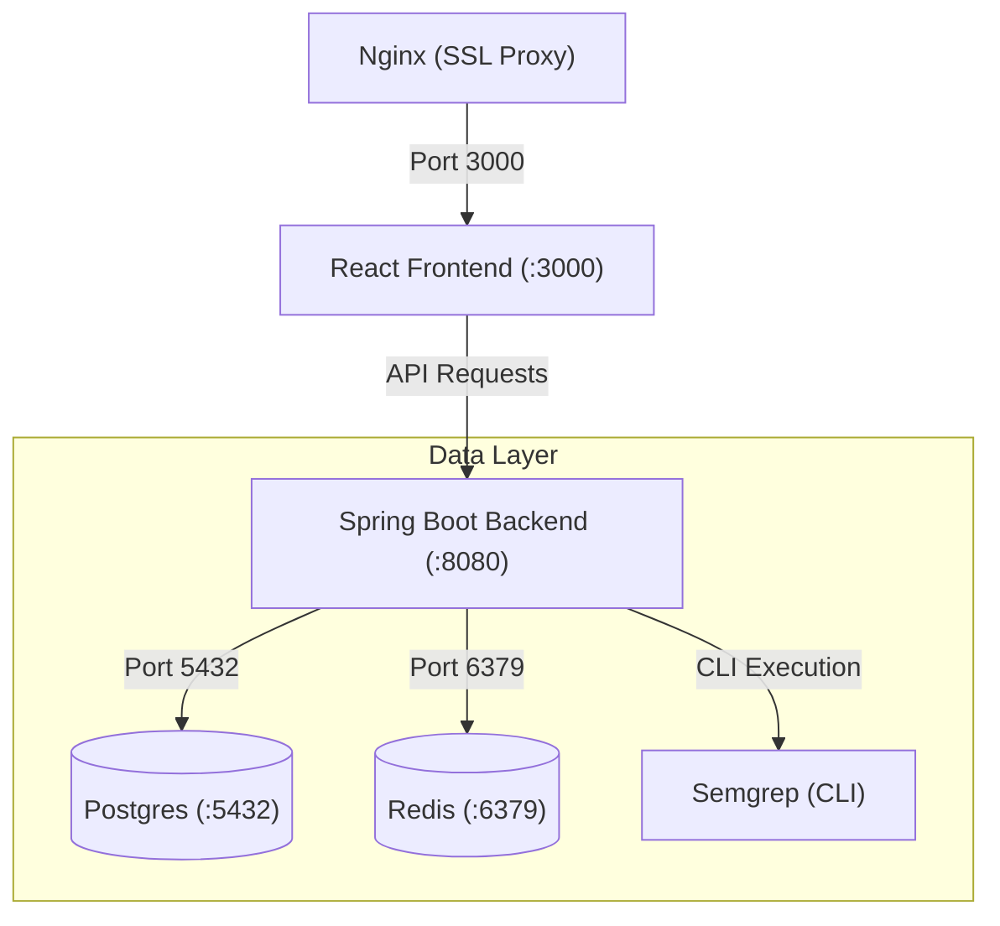

# Deployment

JQube supports multiple deployment methods. Choose the one that fits your infrastructure.

## Deployment Options

<Cards>
  <Card title="Docker" href="/docs/docker" icon={<Box />}>
    Single container deployment with Docker.
  </Card>
  <Card title="Docker Compose" href="/docs/docker-compose" icon={<Layers />}>
    Full stack deployment with all services.
  </Card>
  <Card title="GitHub Actions" href="/docs/github-actions" icon={<Workflow />}>
    CI/CD pipeline for automated deployment.
  </Card>
</Cards>

## Quick Deploy

The fastest way to deploy JQube is with Docker Compose:

```bash title="Terminal"
# Clone the repository
git clone https://github.com/jqube/jqube.git
cd jqube

# Configure environment
cp .env.example .env
# Edit .env with your credentials

# Deploy
docker compose -f docker-compose.prod.yml up -d
```

## Production Checklist

Before deploying to production, ensure:

- [ ] **Environment variables** are configured correctly
- [ ] **GitHub OAuth app** is set up with production URLs
- [ ] **Database** has proper backups configured
- [ ] **SSL/TLS** is enabled (use a reverse proxy like Nginx or Traefik)
- [ ] **Domain** is configured with DNS records
- [ ] **JWT secret** is a unique, strong random string
- [ ] **Rate limiting** is configured for API endpoints
- [ ] **Monitoring** and logging are set up
- [ ] **CORS** origins are restricted to your domain

<Callout type="warning">
Never deploy with default credentials. Always change the database password, JWT secret, and API keys before going to production.
</Callout>

## Architecture in Production



